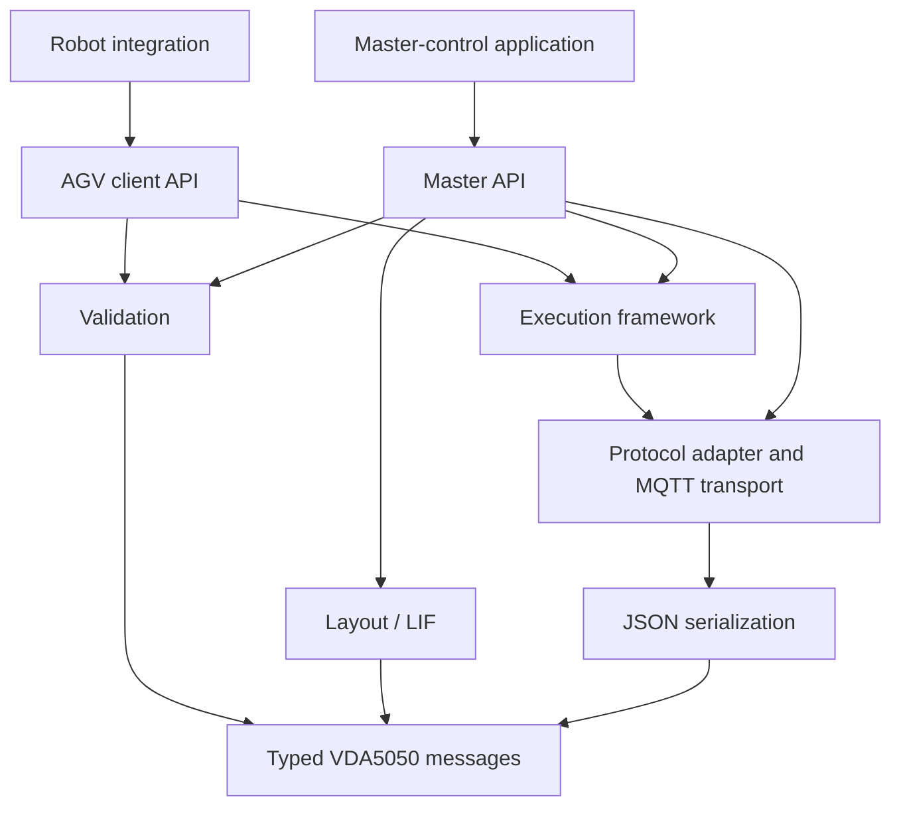

# VDA5050 Library and Support Tools

`vda5050_core` is a C++17 library for building applications that communicate using VDA5050 2.0. It provides reusable components for both automated guided vehicle and autonomous mobile robot (AGV/AMR) integrations, as well as master-control applications.

VDA5050 defines a common communication interface between mobile robots and master control systems. This library provides the message types, validation, communication tools, and execution framework needed to build VDA5050-compatible applications.

Developers can use these components instead of implementing the full protocol from scratch.

> **Project status:** This project is under active development. APIs and behavior may change as VDA5050 support evolves.

## Features

- Strongly typed C++ representations of VDA5050 messages
- JSON serialization and deserialization using VDA5050 field names
- Validation for messages, orders, actions and states
- MQTT transport and a typed VDA5050 protocol adapter
- Event-driven execution components, strategies, contexts, and handlers
- Libraries for both AGV-side clients and master-control applications
- VDA5050 layout interchange format (LIF) loading and validation
- Optional conversion support for ROS 2 `vda5050_interfaces` messages

The main library APIs do not depend on `rclcpp`. However, the repository is packaged and built using ROS 2 `ament_cmake`.

## Architecture

The diagram below shows the main public components of the library. See the[execution design guide](vda5050_core/docs/design.md) for the detailed runtime model.




## Requirements

The continuous-integration build currently tests ROS 2 Humble and Jazzy. To build the package, you need:

- ROS 2 with `ament_cmake`, `colcon`, and `rosdep`
- A C++17 compiler and CMake 3.8 or newer
- Eclipse Paho MQTT C and C++ libraries
- `{fmt}`
- `nlohmann/json`
- An MQTT broker when running MQTT-based integrations or transport tests

When `ENABLE_ROS2=ON`, the `vda5050_interfaces` package must also be available in the workspace.

## Build

Create a ROS 2 workspace and clone the repository into its `src` directory:

```bash
mkdir -p ~/vda5050_ws/src
cd ~/vda5050_ws/src
git clone https://github.com/ros-industrial/vda5050_core.git
```

Install declared dependencies from the workspace root:

```bash
cd ~/vda5050_ws
rosdep install --from-paths src --ignore-src --rosdistro "$ROS_DISTRO" -r -y
```

Build and source the package:

```bash
colcon build --packages-select vda5050_core
source install/setup.bash
```

The following CMake options are available:


| Option           | Default | Purpose                                                  |
| ---------------- | ------- | -------------------------------------------------------- |
| `BUILD_EXAMPLES` | `ON`    | Build the included execution examples                    |
| `BUILD_TESTING`  | `ON`    | Build tests and configure lint checks                    |
| `ENABLE_ROS2`    | `OFF`   | Enable JSON conversion for `vda5050_interfaces` messages |


For example, enable ROS 2 message conversion with:

```bash
colcon build --packages-select vda5050_core \
  --cmake-args -DENABLE_ROS2=ON
```


## Run an Example

The installed examples exercise the execution framework and do not require an MQTT broker. After building and sourcing the workspace, start with:

```bash
ros2 run vda5050_core engine_example
```

Other included examples are:


| Executable            | Demonstrates                                                   |
| --------------------- | -------------------------------------------------------------- |
| `custom_base`         | Defining and identifying custom events, updates, and resources |
| `provider_example`    | Publishing typed updates to registered listeners               |
| `engine_example`      | Priority events and waiting for matching updates               |
| `handler_integration` | Combining a context, strategy, engine, and handler             |


## Use from CMake

Installed targets are exported under the `vda5050_core::` namespace. Link only the component needed by your application, for example:

```cmake
find_package(vda5050_core REQUIRED)

target_link_libraries(my_application
  PRIVATE
    vda5050_core::client
    vda5050_core::json_utils
)
```

Exported component targets include `types`, `json_utils`, `logger`, `errors`,`validation`, `transport`, `execution`, `client`, `layout`, and `master`.

## Documentation


| Guide                                                              | Description                                                |
| ------------------------------------------------------------------ | ---------------------------------------------------------- |
| [Types and serialization](vda5050_core/docs/types.md)              | Create VDA5050 C++ types and convert them to and from JSON |
| [Usage](vda5050_core/docs/usage.md)                                | Use the protocol adapter and execution framework           |
| [Execution design](vda5050_core/docs/design.md)                    | Understand execution components and their relationships    |
| [Migration from Open-RMF](vda5050_core/docs/migration-from-rmf.md) | Map an `rmf_fleet_adapter` integration to `vda5050_core`   |


## Contributing and License

Contributions must include a Developer Certificate of Origin sign-off. See[CONTRIBUTING.md](CONTRIBUTING.md) for details. This project is licensed under the [Apache License 2.0](LICENSE).