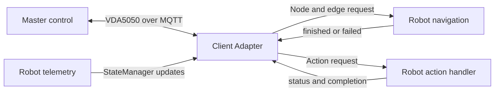

# Client Adapter

This guide explains how to connect robot software to a VDA5050 master control using the client adapter in `vda5050_core::client::adapter`.

## 1. Overview

The client adapter provides a high-level interface for building an AGV-side VDA5050 client.

It handles common VDA5050 functions such as:

- MQTT communication
- VDA5050 topic names
- JSON conversion
- order processing
- navigation requests
- instant actions
- connection messages
- state messages
- factsheet messages

The adapter handles the VDA5050 communication flow.

The robot integration remains responsible for:

- controlling the robot hardware
- navigating to requested positions
- performing robot-specific actions
- reading robot state
- reporting whether a request finished or failed




## 2. Main APIs

All client adapter classes are in `vda5050_core::client::adapter`.


| API               | Purpose                                               |
| ----------------- | ----------------------------------------------------- |
| `Adapter`         | Registers callbacks and controls the client lifecycle |
| `NodeRequest`     | Describes the next node the AGV should reach          |
| `EdgeRequest`     | Describes the optional edge leading to the node       |
| `OrderExecution`  | Reports navigation success or failure                 |
| `ActionRequest`   | Describes an action passed to the robot integration   |
| `ActionExecution` | Reports action progress, success, or failure          |
| `StateManager`    | Stores the AGV state published by the adapter         |


## 3. Create the Adapter

Create an MQTT client and `ProtocolAdapter`, then use them to create the client adapter.

```cpp
#include <memory>

#include "vda5050_core/client/adapter/adapter.hpp"
#include "vda5050_core/execution/protocol_adapter.hpp"
#include "vda5050_core/transport/mqtt_client_interface.hpp"

using vda5050_core::client::adapter::Adapter;
using vda5050_core::execution::ProtocolAdapter;

auto mqtt_client = vda5050_core::transport::create_default_client_unique(
  "tcp://localhost:1883", "my-robot-client");

auto protocol_adapter = ProtocolAdapter::make(
  std::move(mqtt_client),
  "uagv",       // Interface name
  "2.0.0",      // VDA5050 version
  "MyCompany",  // Manufacturer
  "AGV-001");   // Serial number

auto adapter = Adapter::make(protocol_adapter);
```

The MQTT client ID must be unique at the broker. The interface, manufacturer, and serial number determine the AGV topic identity, for example:

```text
uagv/v2/MyCompany/AGV-001/order
uagv/v2/MyCompany/AGV-001/instantActions
uagv/v2/MyCompany/AGV-001/state
```


## 4. Handle Navigation

Register the navigation callback before starting the adapter.

```cpp
#include <optional>
#include <thread>

#include "vda5050_core/client/adapter/edge_request.hpp"
#include "vda5050_core/client/adapter/node_request.hpp"
#include "vda5050_core/client/adapter/order_execution.hpp"

using vda5050_core::client::adapter::EdgeRequest;
using vda5050_core::client::adapter::NodeRequest;
using vda5050_core::client::adapter::OrderExecution;

auto state_manager = adapter->state_manager();

adapter->on_navigate(
  [state_manager](
    NodeRequest node, std::optional<EdgeRequest> edge,
    std::shared_ptr<OrderExecution> execution) {
    // Transfer long-running work to a robot-owned worker.
    std::thread([state_manager, node, edge, execution]() {
      state_manager->set_driving(true);

      try
      {
        // Replace this with the robot navigation API.
        // navigate_to(node.node_position(), edge);

        state_manager->set_driving(false);
        execution->finished();
      }
      catch (const std::exception& error)
      {
        state_manager->set_driving(false);
        execution->failed(error.what());
      }
    }).detach();
  });
```

`NodeRequest` provides the node ID, sequence ID, optional position, and optional description. `EdgeRequest` provides optional trajectory, speed, height, rotation, and length constraints. An edge may not be available when there is no preceding edge for the node.

The adapter waits for the current navigation request to complete before continuing. Every navigation request should report one final result:

```
execution->finished();
```

or:

```
execution->failed("Failure reason");
```

Call `finished()` only after the AGV physically reaches the requested node. Keep the execution handle alive while asynchronous navigation work is running.

Production code should use a managed worker thread or task queue instead of an unmanaged detached thread. 

## 5. Handle Actions

Register an action callback before starting the adapter.

```cpp
#include "vda5050_core/client/adapter/action_execution.hpp"
#include "vda5050_core/client/adapter/action_request.hpp"

using vda5050_core::client::adapter::ActionExecution;
using vda5050_core::client::adapter::ActionRequest;

adapter->on_action(
  [](ActionRequest request, std::shared_ptr<ActionExecution> execution) {
    execution->running();

    if (request.action_type() == "startCharging")
    {
      // Start charging through the robot API.
      execution->finished("Charging started");
      return;
    }

    execution->failed("Unsupported action: " + request.action_type());
  });
```

`ActionRequest` exposes the action ID, type, optional parameters, description, and optional order information. Use the `ActionExecution` handle to report the action status.


| Method                  | Effect                                             |
| ----------------------- | -------------------------------------------------- |
| `running()`             | Publishes `RUNNING`                                |
| `paused(description)`   | Publishes `PAUSED` with an optional description    |
| `finished()`            | Completes with `FINISHED`                          |
| `finished(description)` | Completes with `FINISHED` and a result description |
| `failed(reason)`        | Completes with `FAILED` and the reason             |


Some standard instant actions may be handled internally by the adapter. Other supported actions are passed to the registered action callback.

## 6. Report AGV State

Use `StateManager` to update the current AGV state.

```cpp
#include "vda5050_core/types/battery_state.hpp"
#include "vda5050_core/types/operating_mode.hpp"

state_manager->set_position(1.2, 3.4, 0.5, "map1");
state_manager->set_driving(true);
state_manager->set_operating_mode(
  vda5050_core::types::OperatingMode::AUTOMATIC);

vda5050_core::types::BatteryState battery{};
battery.battery_charge = 82.0;
battery.charging = false;
state_manager->set_battery_state(battery);
```

`StateManager` also supports information such as:

- velocity
- paused state
- safety state
- distance since the last node
- loads
- errors
- information messages
- action states

Some order-related fields are managed by the adapter.

These include:

- `orderId`
- `orderUpdateId`
- `nodeStates`
- `edgeStates`
- `lastNodeId`
- `lastNodeSequenceId`

The robot integration should update the physical AGV state through `StateManager`. The state thread publishes at least every 30 seconds and after internal order or action events request an update. State setter methods update the next published snapshot; they do not all trigger an immediate publish by themselves.

For optional lists, an empty list and an unavailable list may have different meanings. 

For example:

```
state_manager->clear_loads();
```

can be used when the AGV is known to have no loads.

A separate remove method may be used when the load information is not available. Check the current branch API for the exact supported methods.

## 7. Configure the Factsheet

A factsheet describes the AGV's capabilities and physical properties.

```cpp
vda5050_core::types::Factsheet factsheet{};
// Populate the factsheet supported by this AGV.
adapter->set_factsheet(factsheet);
```

Configure the factsheet before calling `start()` when the application needs to respond to `factsheetRequest`.

## 8. Start and Stop

Register the required callbacks and initialize the AGV state before starting the adapter.

```cpp
adapter->start();

// Keep the application alive until shutdown.

adapter->stop();
```

`start()` starts the client connection and internal processing:

- connect to the MQTT broker
- subscribe to order topics
- subscribe to instant action topics
- publish an `ONLINE` connection message
- start the request dispatch loop
- start the state publication loop

`stop()` shuts down the client:

- stop the internal loops
- join internal threads
- unsubscribe from MQTT topics
- publish an `OFFLINE` connection message
- disconnect from the broker

The adapter may also call `stop()` when it is destroyed. Calling `stop()` explicitly is still recommended because it provides a clear and predictable shutdown order.

## 9. CMake Integration

Link the client target in the application.

```
find_package(vda5050_core REQUIRED)

target_link_libraries(my_robot_adapter
  PRIVATE
    vda5050_core::client
)
```

Add other targets only when they are used directly by the application.

For example:

```
target_link_libraries(my_robot_adapter
  PRIVATE
    vda5050_core::client
    vda5050_core::transport
)
```

The exact required targets depend on the exported dependencies of the current  
branch.

## 10. Build and Run the Example

Build the package with examples enabled.

```
colcon build \
  --packages-select vda5050_core \
  --cmake-args -DBUILD_EXAMPLES=ON
```

Start a local MQTT broker:

```
mosquitto -d
```

Source the workspace:

```
source install/setup.bash
```

Run the adapter example:

```
ros2 run vda5050_core adapter_example
```

The example demonstrates the basic client adapter flow.

It may include:

- MQTT connection
- navigation callbacks
- action callbacks
- AGV state updates
- simulated request completion

See the current example source for the exact behavior:

```
examples/client/adapter_example.cpp
```


## 11. Experimental Limitations

The client adapter is still experimental.