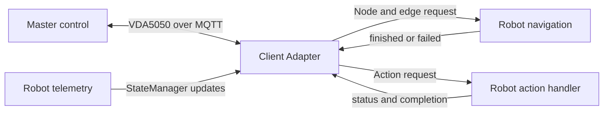

# Client Adapter

This guide explains how to connect an existing robot to a VDA5050 master control using the C++ client adapter provided by `vda5050_core::client::adapter`.

The client adapter handles VDA5050 communication and order processing. It does not directly control a robot.

To use it with an existing robot, create one C++ integration application that connects the client adapter to the robot's SDK, API, ROS 2 interface, or control software.




## Table of Contents

1. [Start from the Existing Example](#1-start-from-the-existing-example)
2. [Build and Run the Packaged Example](#2-build-and-run-the-packaged-example)
3. [Create Your Own Robot Integration](#3-create-your-own-robot-integration)
  3.1 [Change the MQTT Configuration and Robot Identity](#31-change-the-mqtt-configuration-and-robot-identity)  
  3.2 [Replace Simulated Navigation](#32-replace-simulated-navigation)  
  3.3 [Report Navigation Completion](#33-report-navigation-completion)  
  3.4 [Replace Simulated Actions](#34-replace-simulated-actions)  
  3.5 [Connect Localization](#35-connect-localization)  
  3.6 [Replace Simulated State with Real Robot State](#36-replace-simulated-state-with-real-robot-state)  
  3.7 [Coordinate Frames](#37-coordinate-frames)  
  3.8 [Configure the Factsheet](#38-configure-the-factsheet)  
  3.9 [Keep the Existing Start and Stop](#39-keep-the-existing-start-and-stop-flow)   
  3.10 [Update CMake](#310-update-cmake)  
4. [Build and Test Your Robot Integration](#4-build-and-test-your-robot-integration)
5. [Summary of Required Changes](#5-summary-of-required-changes)


## 1. Start from the Existing Example

Use the following file as the starting template:

```
examples/client/adapter_example.cpp
```

The example already handles:

- MQTT communication,
- VDA5050 order processing,
- adapter startup and shutdown,
- navigation callbacks,
- action callbacks,
- localization callbacks, and
- robot state reporting.

To integrate a real robot, copy the example into the robot integration package and replace the simulated behaviour with the robot's SDK, ROS 2 interface, or control API.

> Calls such as `robot_driver.navigate_to()` in this guide are placeholders. They are not part of `vda5050_core`.


### What You Need to Change


| Part                  | What to replace                                               |
| --------------------- | ------------------------------------------------------------- |
| MQTT configuration    | Broker address and MQTT client ID                             |
| Robot identity        | Manufacturer and serial number                                |
| Navigation callback   | Simulated delay with the robot navigation command             |
| Navigation result     | Report completion or failure from the robot navigation status |
| Action callback       | Simulated action with supported robot commands                |
| Localization callback | Connect to the robot localization interface                   |
| State updates         | Use real position, battery, movement, and safety data         |
| Factsheet             | Describe the actual robot capabilities                        |


## 2. Build and Run the Packaged Example

Build the package with examples enabled:

```
colcon build \
  --packages-select vda5050_core \
  --cmake-args -DBUILD_EXAMPLES=ON
```

Start an MQTT broker:

```
mosquitto -d
```

Source the workspace:

```
source install/setup.bash
```

Run the packaged example:

```
ros2 run vda5050_core adapter_example
```

Run this example first to confirm that the MQTT connection and client-adapter flow work before connecting a physical robot.

## 3. Create Your Own Robot Integration

After the packaged example works:

- Copy `adapter_example.cpp` into the `src/` directory of an existing robot integration package and rename it.

For example:

```
my_robot_integration/
├── CMakeLists.txt
├── package.xml
└── src/
    └── my_robot_vda5050_adapter.cpp
```

If no robot integration package exists yet, create a new C++ or ROS 2 package that depends on `vda5050_core`.    

- Update the MQTT broker and robot identity.
- Replace simulated navigation with the robot's navigation command.
- Replace simulated actions with the robot's supported actions.
- Connect localization when required.
- Read real robot telemetry and update `StateManager`.
- Report navigation and action completion or failure.
- Build and run the new robot-specific application.

A simple integration can use one C++ source file. You do not need to create a separate program for every section in this guide. You also do not need to modify `vda5050_core`. The new application uses `vda5050_core` as a library.

### 3.1 Change the MQTT Configuration and Robot Identity

The first part of the integration application creates the MQTT connection and identifies the robot.

Find:

```
auto mqtt_client =
  vda5050_core::transport::create_default_client_unique(
    "tcp://localhost:1883",
    "adapter_example");

auto protocol_adapter = ProtocolAdapter::make(
  std::move(mqtt_client),
  "uagv",
  "2.0.0",
  "Manufacturer",
  "S001");
```

Replace the values with the deployment configuration:

```
auto mqtt_client =
  vda5050_core::transport::create_default_client_unique(
    "tcp://192.168.1.10:1883",
    "robot_1_vda5050_adapter");

auto protocol_adapter = ProtocolAdapter::make(
  std::move(mqtt_client),
  "uagv",
  "2.0.0",
  "MyCompany",
  "AGV-001");
```

Replace the example values with the configuration used by the robot integration.


| Value                  | Meaning                |
| ---------------------- | ---------------------- |
| `tcp://localhost:1883` | MQTT broker address    |
| `my-robot-client`      | Unique MQTT client ID  |
| `uagv`                 | VDA5050 interface name |
| `2.0.0`                | VDA5050 version        |
| `MyCompany`            | Robot manufacturer     |
| `AGV-001`              | Robot serial number    |


The MQTT client ID must be unique at the broker.

The manufacturer and serial number must match the identity configured in the VDA5050 master.

For example:

```
uagv/v2/MyCompany/AGV-001/order
uagv/v2/MyCompany/AGV-001/instantActions
uagv/v2/MyCompany/AGV-001/state
uagv/v2/MyCompany/AGV-001/connection
```


### 3.2 Replace Simulated Navigation

The example currently simulates navigation using a delay:

```
adapter->on_navigate(
  [state_manager](
    NodeRequest node_request,
    std::optional<EdgeRequest> edge_request,
    std::shared_ptr<OrderExecution> execution)
  {
    std::thread(
      [node_request, execution, state_manager]()
      {
        state_manager->set_driving(true);

        std::this_thread::sleep_for(
          std::chrono::seconds(2));

        state_manager->set_driving(false);
        execution->finished();
      })
      .detach();
  });
```

Replace the delay with the robot's navigation command.

```
std::shared_ptr<OrderExecution> active_navigation;

adapter->on_navigate(
  [&](NodeRequest node_request,
      std::optional<EdgeRequest> edge_request,
      std::shared_ptr<OrderExecution> execution)
  {
    const auto position = node_request.node_position();

    if (!position.has_value())
    {
      execution->failed(
        "Requested node does not contain a position");
      return;
    }

    active_navigation = execution;

    state_manager->set_driving(true);

    // Replace with the robot navigation interface.
    robot_driver.navigate_to(
      position->x,
      position->y,
      position->theta.value_or(0.0),
      position->map_id);
  });
```

Do not call `execution->finished()` immediately after sending the navigation command.

Keep the execution handle until the robot reaches the destination or reports a failure.

The optional `EdgeRequest` may contain additional movement constraints, such as speed or trajectory information. Use it only when required by the robot.

### 3.3 Report Navigation Completion

Check the robot navigation result in the main loop or through the robot's completion callback.

```
if (active_navigation &&
    robot_driver.navigation_completed())
{
  state_manager->set_driving(false);

  active_navigation->finished();
  active_navigation.reset();
}

if (active_navigation &&
    robot_driver.navigation_failed())
{
  state_manager->set_driving(false);

  active_navigation->failed(
    robot_driver.navigation_failure_reason());

  active_navigation.reset();
}
```

Every navigation request must end with either:

```
execution->finished();
```

or:

```
execution->failed("Failure reason");
```

Call `finished()` only after the robot has actually reached the requested node.

The example copies the requested node position into `StateManager` because movement is simulated. A real integration should report position using the robot's localization or odometry data.

### 3.4 Replace Simulated Actions

The example currently simulates an action using a one-second delay:

```
adapter->on_action(
  [](ActionRequest request,
     std::shared_ptr<ActionExecution> execution)
  {
    execution->running();

    std::this_thread::sleep_for(
      std::chrono::seconds(1));

    execution->finished();
  });
```

Replace this with the supported robot actions:

```
std::shared_ptr<ActionExecution> active_action;

adapter->on_action(
  [&](ActionRequest request,
      std::shared_ptr<ActionExecution> execution)
  {
    if (request.action_type() == "startCharging")
    {
      execution->running();
      active_action = execution;

      // Replace with the robot action interface.
      robot_driver.start_charging();
      return;
    }

    execution->failed(
      "Unsupported action: " +
      request.action_type());
  });
```

Only implement action types supported by the robot.

Use `ActionExecution` to report the action state.


| Method                  | Effect                                       |
| ----------------------- | -------------------------------------------- |
| `running()`             | Reports `RUNNING`                            |
| `paused(description)`   | Reports `PAUSED`                             |
| `finished()`            | Reports `FINISHED`                           |
| `finished(description)` | Reports `FINISHED` with a result description |
| `failed(reason)`        | Reports `FAILED` with a reason               |


For long-running actions, keep the execution handle and report the result later:

```
if (active_action &&
    robot_driver.action_completed())
{
  active_action->finished();
  active_action.reset();
}

if (active_action &&
    robot_driver.action_failed())
{
  active_action->failed(
    robot_driver.action_failure_reason());

  active_action.reset();
}
```

Use `ActionExecution` to report action progress:

```
execution->initializing();
execution->running();
execution->paused();
execution->finished();
execution->failed("Failure reason");
```

Do not block the adapter callback while waiting for a long-running action.

### 3.5 Connect Localization

The example immediately accepts the requested position:

```
adapter->on_localize(
  [state_manager](
    LocalizationRequest request,
    std::shared_ptr<ActionExecution> execution)
  {
    execution->finished();

    state_manager->set_position(
      request.x(),
      request.y(),
      request.theta(),
      request.map_id());
  });
```

Replace this with the robot localization interface:

```
adapter->on_localize(
  [&](LocalizationRequest request,
      std::shared_ptr<ActionExecution> execution)
  {
    execution->running();

    const bool accepted =
      robot_driver.set_initial_pose(
        request.x(),
        request.y(),
        request.theta(),
        request.map_id());

    if (accepted)
    {
      execution->finished();
    }
    else
    {
      execution->failed(
        "Robot rejected the localization request");
    }
  });
```

The robot's actual position should continue to come from localization or odometry telemetry.

### 3.6 Replace Simulated State with Real Robot State

Obtain the state manager:

```
auto state_manager = adapter->state_manager();
```

Update it using real robot telemetry.

### Position

```
const auto pose = robot_driver.current_pose();

state_manager->set_position(
  pose.x,
  pose.y,
  pose.theta,
  pose.map_id);
```


### Driving state

```
state_manager->set_driving(
  robot_driver.is_moving());
```


### Operating mode

```
state_manager->set_operating_mode(
  vda5050_core::types::OperatingMode::AUTOMATIC);
```


### Battery

```
vda5050_core::types::BatteryState battery{};

battery.battery_charge =
  robot_driver.battery_percentage();

battery.charging =
  robot_driver.is_charging();

state_manager->set_battery_state(battery);
```

The integration may also update:

- velocity,
- paused state,
- safety state,
- distance since the last node,
- loads,
- errors, and
- information messages.

Order-related fields such as the current order, node states, edge states, and last reached node are managed by the adapter.

### 3.7 Coordinate Frames

The robot's coordinate frame must match the layout used by the VDA5050 master control.

The following values must be consistent:

- map ID
- x-coordinate
- y-coordinate
- orientation
- distance units
- angle units

If the robot uses a different coordinate frame, convert the requested destination before sending it to the robot.

Apply the same transformation before updating the robot position through `StateManager`.

Keep coordinate transformations in one place to avoid inconsistent navigation and state data.

### 3.8  Configure the Factsheet

Create a factsheet describing the real robot:

```
vda5050_core::types::Factsheet factsheet{};

// Populate the supported robot capabilities.

adapter->set_factsheet(factsheet);
```

The factsheet may include:

- supported actions,
- robot dimensions,
- load capabilities,
- velocity limits,
- acceleration limits, and
- supported protocol features.

Configure it before starting the adapter.

Do not advertise capabilities that the robot does not support.

### 3.9 Keep the Existing Start and Stop Flow

The startup and shutdown section of the example can remain mostly unchanged.

Register the callbacks first:

```
adapter->on_navigate(...);
adapter->on_action(...);
adapter->on_localize(...);
```

Start the adapter:

```
adapter->start();
```

Update robot status while the application is running:

```
while (running)
{
  update_robot_state();
  update_navigation_status();
  update_action_status();

  std::this_thread::sleep_for(
    std::chrono::milliseconds(100));
}
```

Stop the adapter during shutdown:

```
adapter->stop();
```


### 3.10 Update CMake

Add the executable:

```
add_executable(
  my_robot_vda5050_adapter
  src/my_robot_vda5050_adapter.cpp
)
```

Link the required libraries:

```
target_link_libraries(
  my_robot_vda5050_adapter
  PRIVATE
    vda5050_core::client
    vda5050_core::transport
    vda5050_core::logger
)
```

Install the executable:

```
install(
  TARGETS my_robot_vda5050_adapter
  DESTINATION lib/${PROJECT_NAME}
)
```

Add the package dependency:

```
<depend>vda5050_core</depend>
```


## 4. Build and Test Your Robot Integration

Build the integration package:

```
colcon build \
  --packages-select my_robot_integration
```

Source the workspace:

```
source install/setup.bash
```

Run the integration:

```
ros2 run \
  my_robot_integration \
  my_robot_vda5050_adapter
```

Confirm that:

- the adapter connects to the MQTT broker,
- navigation requests reach the robot,
- navigation finishes only after arrival,
- navigation failures are reported,
- supported actions execute correctly,
- unsupported actions are rejected,
- localization requests reach the robot,
- real robot state is reported, and
- the adapter stops cleanly.


## 5. Summary of Required Changes

When adapting `adapter_example.cpp`, developers mainly need to replace:

```
MQTT settings
Robot manufacturer and serial number
Simulated navigation delay
Simulated action delay
Simulated localization handling
Simulated position updates
Factsheet contents
CMake executable name
```

The adapter creation, callback registration, startup loop, and shutdown flow can remain largely unchanged.