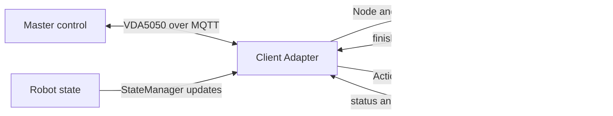

# vda5050_core::client::adapter

This guide explains how to integrate an AGV with a VDA5050 master control using the `vda5050_core::client::adapter` library.

## 1. Overview

The Adapter is a pready-to-use VDA5050 AGV client. 

The lower-level `vda5050_core::execution` library provides the components needed to build a client. The Adapter connects these components together for a common setup:

- one AGV
- one VDA5050 master control
- MQTT communication
- navigation requests
- action requests
- AGV state reporting




The Adapter handles the VDA5050 protocol and message flow.

The robot integration is still responsible for:

- controlling the AGV hardware
- navigating to requested positions
- performing actions
- updating the AGV state
- reporting whether work finished or failed

The Adapter hides most of the lower-level execution components.


| Design component           | Provided by the Adapter as                               |
| -------------------------- | -------------------------------------------------------- |
| `ProtocolAdapter`          | Constructed by the integrator, passed to `Adapter::make` |
| `Context`                  | `AgvContext`, created internally                         |
| `Strategy`                 | Order acceptance and validation, created internally      |
| `Handler`                  | The Adapter's internal dispatch loop                     |
| `UpdateBase` / `EventBase` | Surfaced as Requests and Executions                      |


The integrator never implements a Strategy or a Context. Instead, three concepts are exposed:

- **Requests** describe what the AGV must do. They are read-only snapshots delivered to a callback (`NodeRequest`, `EdgeRequest`, `ActionRequest`, `LocalizationRequest`).
- **Executions** are handles used to report back the outcome of a Request (`OrderExecution`, `ActionExecution`). They are the acknowledgement path.
- **StateManager** is the AGV's view of itself. The integrator pushes position, velocity, battery and load into it; the Adapter turns that into a VDA5050 `state` message.

The direction of the flow is therefore the inverse of the execution library: the Adapter calls the integrator, not the other way round.

The adapter handles protocol concerns while the robot integration remains responsible for commanding hardware and reporting when work completes.

### 1.1 Main APIs

All adapter classes are in `vda5050_core::client::adapter`.


| API               | Purpose                                                         |
| ----------------- | --------------------------------------------------------------- |
| `Adapter`         | Configures callbacks and controls the MQTT lifecycle            |
| `NodeRequest`     | Describes the next node the robot must reach                    |
| `EdgeRequest`     | Provides optional constraints for the edge leading to that node |
| `OrderExecution`  | Reports navigation success or failure                           |
| `ActionRequest`   | Describes an instant action dispatched to robot software        |
| `ActionExecution` | Reports action status, success, or failure                      |
| `StateManager`    | Updates the AGV state snapshot published by the adapter         |


### 1.2 Integration Flow

A typical integration follows these steps:

1. Create an MQTT client.
2. Create a `ProtocolAdapter`.
3. Create the client `Adapter`.
4. Register navigation, action, and localization callbacks.
5. Get the `StateManager`.
6. Start the Adapter.
7. Handle requests from the Adapter.
8. Report completion through the Execution handles.
9. Stop the Adapter during application shutdown.


## 2. Getting Started

A minimal client requires an MQTT client, a `ProtocolAdapter`, and the callbacks the AGV is able to serve.

```cpp
  using namespace vda5050_core::client::adapter;

  // Transport. The Adapter does not own or manage the MQTT connection
  // parameters, it only uses the client handed to the ProtocolAdapter
  auto mqtt_client = vda5050_core::transport::create_default_client_unique(
    "tcp://localhost:1883", "adapter_example");

  // Protocol. Handles topic naming, headerId increments and timestamps
  auto protocol_adapter = vda5050_core::execution::ProtocolAdapter::make(
    std::move(mqtt_client), "uagv", "2.0.0", "Manufacturer", "S001");

  auto adapter = Adapter::make(protocol_adapter);

  // Register the AGV capabilities before starting
  adapter->on_navigate(...);
  adapter->on_action(...);
  adapter->on_localize(...);

  // Connects, publishes ONLINE, subscribes to order and instantActions
  // topics, and starts the internal loops
  adapter->start();

  // ... application runs ...

  // Stops the loops and publishes OFFLINE
  adapter->stop();
```

`start()` must be called after the callbacks are registered. Requests that arrive for which no callback is registered are not dispatched.

## 3. Navigation

`on_navigate` is invoked once per node of the order base, in sequence order. The `NodeRequest` describes the target; the `EdgeRequest` describes how to get there and is absent for the first node of an order.

```cpp
  adapter->on_navigate(
    [state_manager](
      NodeRequest node_request, std::optional<EdgeRequest> edge_request,
      std::shared_ptr<OrderExecution> execution)
    {
      // The callback must return promptly. Long running work belongs on the
      // AGV's own thread
      std::thread([node_request, execution, state_manager]()
        {
          state_manager->set_driving(true);

          // ... drive the AGV to node_request.node_position() ...

          state_manager->set_driving(false);

          // Report the outcome. Exactly one of finished() or failed() must
          // be called for every request
          execution->finished();
        }).detach();
    });
```

The Adapter does not proceed to the next node until the current `OrderExecution` completes. If the AGV cannot reach the node, call `execution->failed("reason")`; the reason is reported to the master control.

`execution->okay()` returns false once the Adapter has deactivated the execution, for example because the order was cancelled or replaced by an order update. Long running navigation loops should poll it and abort early.

## 4. Actions

`on_action` receives every action the AGV is expected to perform. Unlike navigation, actions report intermediate status, which the Adapter maps onto the VDA5050 `actionStates` array.

```cpp
  adapter->on_action(
    [](ActionRequest request, std::shared_ptr<ActionExecution> execution)
    {
      execution->initializing();

      // ... prepare ...

      execution->running();

      // ... perform request.action_type() with request.action_parameters() ...

      execution->finished("optional result description");
    });
```

Three instant action types are handled by the Adapter itself and are never forwarded to `on_action`:


| Action type        | Handled by                                      |
| ------------------ | ----------------------------------------------- |
| `stateRequest`     | Triggers an immediate state publish             |
| `factsheetRequest` | Publishes the factsheet set via `set_factsheet` |
| `initPosition`     | Forwarded to the `on_localize` callback         |


## 5. Localization

`initPosition` is separated from the general action path because it carries a pose rather than free-form parameters.

```cpp
  adapter->on_localize(
    [state_manager](
      LocalizationRequest request, std::shared_ptr<ActionExecution> execution)
    {
      // ... seed the AGV localization with request.x(), request.y(),
      // request.theta() on map request.map_id() ...

      execution->finished();

      state_manager->set_position(
        request.x(), request.y(), request.theta(), request.map_id());
    });
```

Until a position is reported, the AGV is not considered localized.

## 6. Reporting State

`StateManager` is the single place the AGV describes itself. It is thread-safe and may be written to from the AGV's own threads.

```cpp
  auto state_manager = adapter->state_manager();

  state_manager->set_position(x, y, theta, "map_1");
  state_manager->set_velocity(velocity);
  state_manager->set_driving(true);
  state_manager->set_battery_state(battery);
  state_manager->set_operating_mode(vda5050_core::types::OperatingMode::AUTOMATIC);
  state_manager->add_load(load);
  state_manager->add_error(error);
```

Order-related fields (`orderId`, `nodeStates`, `edgeStates`, `lastNodeId`) are owned by the Adapter and cannot be written by the integrator.

State is published when the Adapter observes a significant change, as required by the specification. To force a publish, for example after a battery reading, call `state_manager->mark_publish_requested()`.

## 7. Coordinate Transformation

Master control works in world coordinates; the AGV may not. `Transformation` converts between the two and is registered per map.

```cpp
  // Calibrate from one known correspondence
  auto tf = Transformation::calibrate(world_pose, agv_pose);

  state_manager->set_transformation(tf, "map_1");
```

Once registered, poses written through `set_position` for that map are converted before publishing, and incoming node positions are converted before reaching `on_navigate`.

## 8. Factsheet

```cpp
  vda5050_core::types::Factsheet factsheet;
  // ... populate ...

  adapter->set_factsheet(factsheet);
```

The factsheet is published in response to a `factsheetRequest` instant action. If none is set, the request fails.

## 9. Threading and Lifecycle

- `start()` spawns two internal threads: a dispatch loop that hands Requests to the callbacks, and a state loop that publishes state on request.
- Callbacks are invoked from the dispatch thread. Blocking inside a callback blocks all further dispatch. Hand long running work to an AGV thread and report through the Execution handle.
- `StateManager` and the Execution handles are safe to call from any thread.
- A last-will message is registered so that an unexpected process exit is reported as a `CONNECTIONBROKEN` connection state.
- `stop()` joins the internal threads and publishes `OFFLINE`. It is called automatically on destruction.


## 10. Complete Example

See `examples/client/adapter_example.cpp` for a runnable client that simulates navigation, actions and localization against a local broker.