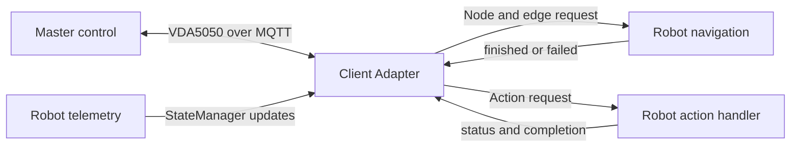

# Client Adapter

This guide explains how to connect an existing robot to a VDA5050 master control using the C++ client adapter provided by `vda5050_core::client::adapter`.

The client adapter handles VDA5050 communication and order processing. It does not directly control a robot.

To use it with an existing robot, create one C++ integration application that connects the client adapter to the robot's SDK, API, ROS 2 interface, or control software.




### Table of Contents

- [Start from the Existing Example](#1-start-from-the-existing-example)
- [Build and Run the Packaged Example](#2-build-and-run-the-packaged-example)
- [Create Your Own Robot Integration](#3-create-your-own-robot-integration)
  - [Configure the Adapter](#31-configure-the-adapter)
  - [Connect Navigation](#32-connect-navigation)
  - [Report Navigation Completion](#33-report-navigation-completion)
  - [Connect Actions](#34-connect-actions)
  - [Connect Localization](#35-connect-localization)
  - [Report Robot State](#36-report-robot-state)
  - [Coordinate Frames](#37-coordinate-frames)
  - [Configure the Factsheet](#38-configure-the-factsheet)
  - [Start and Stop](#39-start-and-stop)
  - [CMake Integration](#310-cmake-integration)
- [Build and Test Your Robot Integration](#4-build-and-test-your-robot-integration)
- [Integration Checklist](#5-integration-checklist)


## 1. Start from the Existing Example

Use the following file as the starting template:

```
examples/client/adapter_example.cpp
```

The example is one complete C++ application. The sections in this guide explain how to modify different parts of that application; they are not separate programs.

The example demonstrates:

- connecting to an MQTT broker
- creating the client adapter
- receiving navigation requests
- receiving action requests
- receiving localization requests
- updating robot state
- starting and stopping the adapter

The example does not control a real robot. It simulates robot behaviour using delays.

For example:

```
std::this_thread::sleep_for(std::chrono::seconds(2));
execution->finished();
```

This waits for two seconds, pretends that the robot reached the requested node, and reports successful completion.

To integrate a real robot, copy the example and replace the simulated behaviour with the robot's actual interface.

## 2. Build and Run the Packaged Example

Build the package with examples enabled:

```
colcon build \
  --packages-select vda5050_core \
  --cmake-args -DBUILD_EXAMPLES=ON
```

Start an MQTT broker:

```
mosquitto -d
```

Source the workspace:

```
source install/setup.bash
```

Run the packaged example:

```
ros2 run vda5050_core adapter_example
```

Run this example first to confirm that the MQTT connection and client-adapter flow work before connecting a physical robot.

## 3. Create Your Own Robot Integration

After the packaged example works:

1. Copy `adapter_example.cpp` into the `src/` directory of an existing robot integration package and rename it.
  For example:
  ```
  my_robot_integration/
    package.xml
    CMakeLists.txt
    src/
      my_robot_vda5050_adapter.cpp
  ```
  If no robot integration package exists yet, create a new C++ or ROS 2 package that depends on `vda5050_core`.
2. Update the MQTT broker and robot identity.
3. Replace simulated navigation with the robot's navigation command.
4. Replace simulated actions with the robot's supported actions.
5. Connect localization when required.
6. Read real robot telemetry and update `StateManager`.
7. Report navigation and action completion or failure.
8. Build and run the new robot-specific application.

A simple integration can use one C++ source file. You do not need to create a separate program for every section in this guide. You also do not need to modify `vda5050_core`. The new application uses `vda5050_core` as a library.

### 3.1 Configure the Adapter

The first part of the integration application creates the MQTT connection and identifies the robot.

```
auto mqtt_client =
  vda5050_core::transport::create_default_client_unique(
    "tcp://localhost:1883",
    "my-robot-client");

auto protocol_adapter = ProtocolAdapter::make(
  std::move(mqtt_client),
  "uagv",
  "2.0.0",
  "MyCompany",
  "AGV-001");

auto adapter = Adapter::make(protocol_adapter);
auto state_manager = adapter->state_manager();
```

Replace the example values with the configuration used by the robot integration.


| Value                  | Meaning                |
| ---------------------- | ---------------------- |
| `tcp://localhost:1883` | MQTT broker address    |
| `my-robot-client`      | Unique MQTT client ID  |
| `uagv`                 | VDA5050 interface name |
| `2.0.0`                | VDA5050 version        |
| `MyCompany`            | Robot manufacturer     |
| `AGV-001`              | Robot serial number    |


The MQTT client ID must be unique at the broker.

The interface name, VDA5050 version, manufacturer, and serial number determine the robot's VDA5050 topic identity.

For example:

```
uagv/v2/MyCompany/AGV-001/order
uagv/v2/MyCompany/AGV-001/instantActions
uagv/v2/MyCompany/AGV-001/state
uagv/v2/MyCompany/AGV-001/connection
```


### 3.2 Connect Navigation

The client adapter calls `on_navigate()` when a VDA5050 order asks the robot to move to the next node.

The callback receives:

- a `NodeRequest`
- an optional `EdgeRequest`
- an `OrderExecution` handle

The packaged example simulates navigation by waiting for two seconds and then reporting success.

A real integration should instead send the requested destination to the robot.

```
std::shared_ptr<OrderExecution> active_navigation;

adapter->on_navigate(
  [&](NodeRequest node_request,
      std::optional<EdgeRequest> edge_request,
      std::shared_ptr<OrderExecution> execution)
  {
    const auto position = node_request.node_position();

    if (!position.has_value())
    {
      execution->failed("Requested node has no position");
      return;
    }

    // Replace this with the robot's actual navigation interface.
    robot_api.navigate_to(
      position.value().x,
      position.value().y,
      position.value().theta.value_or(0.0),
      position.value().map_id);

    active_navigation = execution;
    state_manager->set_driving(true);
  });
```

`robot_api.navigate_to(...)` is only a placeholder.

Replace it with the actual SDK, API, ROS 2 topic, service, or action used by the robot.

The optional `EdgeRequest` may contain information such as:

- trajectory
- speed constraints
- edge length
- rotation constraints

Use this information only when it is required by the robot integration.

### 3.3 Report Navigation Completion

Sending a navigation command does not mean that the robot has already reached the destination.

Do not call `finished()` immediately after sending the command.

Keep the `OrderExecution` handle while navigation is active:

```
active_navigation = execution;
```

Then monitor the robot's navigation status:

```
void update_navigation_status()
{
  if (!active_navigation)
  {
    return;
  }

  if (robot_api.navigation_completed())
  {
    state_manager->set_driving(false);

    active_navigation->finished();
    active_navigation.reset();
    return;
  }

  if (robot_api.navigation_failed())
  {
    state_manager->set_driving(false);

    active_navigation->failed(
      "Robot could not reach the requested node");

    active_navigation.reset();
  }
}
```

Replace:

```
robot_api.navigation_completed()
robot_api.navigation_failed()
```

with the actual status interface provided by the robot.

Every navigation request should end with one final result:

```
execution->finished();
```

or:

```
execution->failed("Failure reason");
```

Call `finished()` only after the robot physically reaches the requested node.

### 3.4 Connect Actions

The client adapter calls `on_action()` when the robot receives an action request.

The packaged example simulates action completion using a one-second delay.

A real integration should map supported VDA5050 action types to the robot's actual action commands.

```
std::shared_ptr<ActionExecution> active_action;

adapter->on_action(
  [&](ActionRequest request,
      std::shared_ptr<ActionExecution> execution)
  {
    if (request.action_type() == "startCharging")
    {
      execution->running();

      // Replace this with the robot's actual action command.
      robot_api.start_charging();

      active_action = execution;
      return;
    }

    execution->failed(
      "Unsupported action: " + request.action_type());
  });
```

Only implement actions supported by the robot.

Use `ActionExecution` to report the action state.


|                         |                                              |
| ----------------------- | -------------------------------------------- |
| Method                  | Effect                                       |
| `running()`             | Reports `RUNNING`                            |
| `paused(description)`   | Reports `PAUSED`                             |
| `finished()`            | Reports `FINISHED`                           |
| `finished(description)` | Reports `FINISHED` with a result description |
| `failed(reason)`        | Reports `FAILED` with a reason               |


For a long-running action, keep the execution handle and report the result later:

```
void update_action_status()
{
  if (!active_action)
  {
    return;
  }

  if (robot_api.action_completed())
  {
    active_action->finished();
    active_action.reset();
    return;
  }

  if (robot_api.action_failed())
  {
    active_action->failed("Robot action failed");
    active_action.reset();
  }
}
```

Some standard instant actions may be handled internally by the adapter. Other supported actions are passed to the registered callback.

### 3.5 Connect Localization

The client adapter calls `on_localize()` when the master control requests the robot to use a specific pose.

```
adapter->on_localize(
  [&](LocalizationRequest request,
      std::shared_ptr<ActionExecution> execution)
  {
    // Replace this with the robot's actual localization interface.
    robot_api.set_initial_pose(
      request.x(),
      request.y(),
      request.theta(),
      request.map_id());

    state_manager->set_position(
      request.x(),
      request.y(),
      request.theta(),
      request.map_id());

    execution->finished();
  });
```

The packaged example immediately accepts the localization request.

For a real robot:

1. send the requested pose to the robot,
2. wait for the robot to accept or complete localization, and
3. report success or failure.

If the robot does not support external localization, handle the request according to the application's requirements.

### 3.6 Report Robot State

The client adapter publishes the AGV state using information stored in `StateManager`.

The robot integration should update `StateManager` using real telemetry from the robot.

For example:

```
const auto pose = robot_api.current_pose();

state_manager->set_position(
  pose.x,
  pose.y,
  pose.theta,
  pose.map_id);

state_manager->set_driving(
  robot_api.is_moving());
```

Update the operating mode:

```
state_manager->set_operating_mode(
  vda5050_core::types::OperatingMode::AUTOMATIC);
```

Update the battery state:

```
vda5050_core::types::BatteryState battery{};

battery.battery_charge =
  robot_api.battery_percentage();

battery.charging =
  robot_api.is_charging();

state_manager->set_battery_state(battery);
```

Replace `robot_api` with the actual telemetry interface used by the robot.

`StateManager` may also support:

- velocity
- paused state
- safety state
- operating mode
- distance since the last node
- loads
- errors
- information messages
- action states

Some order-related fields are managed internally by the adapter.

These may include:

- `orderId`
- `orderUpdateId`
- `nodeStates`
- `edgeStates`
- `lastNodeId`
- `lastNodeSequenceId`

The robot integration should update only the physical state and telemetry that it owns.

State setter methods update the state used by the adapter's publication flow. They do not necessarily publish a message immediately after every setter call.

### 3.7 Coordinate Frames

The robot's coordinate frame must match the layout used by the VDA5050 master control.

The following values must be consistent:

- map ID
- x-coordinate
- y-coordinate
- orientation
- distance units
- angle units

If the robot uses a different coordinate frame, convert the requested destination before sending it to the robot.

Apply the same transformation before updating the robot position through `StateManager`.

Keep coordinate transformations in one place to avoid inconsistent navigation and state data.

### 3.8  Configure the Factsheet

A factsheet describes the robot's capabilities and physical properties.

```
vda5050_core::types::Factsheet factsheet{};

// Populate the factsheet fields supported by the robot.

adapter->set_factsheet(factsheet);
```

The factsheet should describe the actual robot being integrated, including:

- supported actions
- physical dimensions
- limits
- protocol features

Configure the factsheet before calling `start()` when the application needs to respond to `factsheetRequest`.

### 3.9 Start and Stop

Register all callbacks before starting the adapter:

```
adapter->on_navigate(...);
adapter->on_action(...);
adapter->on_localize(...);
```

Then start the adapter:

```
adapter->start();
```

Keep the application running while the adapter is active:

```
while (running)
{
  update_robot_state();
  update_navigation_status();
  update_action_status();

  std::this_thread::sleep_for(
    std::chrono::milliseconds(100));
}
```

Stop the adapter during shutdown:

```
adapter->stop();
```

Calling `stop()` explicitly is recommended because it provides a clear shutdown order.

### 3.10 CMake Integration

Find the package:

```
find_package(vda5050_core REQUIRED)
```

Link the client adapter:

```
target_link_libraries(my_robot_adapter
  PRIVATE
    vda5050_core::client
)
```

If the application directly creates the MQTT transport, it may also require:

```
target_link_libraries(my_robot_adapter
  PRIVATE
    vda5050_core::client
    vda5050_core::transport
)
```

The exact required targets depend on the exported dependencies of the current branch.

## 4. Build and Test Your Robot Integration

The examples in this section use:

package name: `my_robot_integration`  
executable name: `my_robot_vda5050_adapter`  
source file: `src/my_robot_vda5050_adapter.cpp`

Replace these names with those used by the actual project.

Build the robot integration package:

```
colcon build --packages-select my_robot_integration
```

Source the workspace:

```
source install/setup.bash
```

Start the MQTT broker if required:

```
mosquitto -d
```

Run the robot integration application:

```
ros2 run my_robot_integration my_robot_vda5050_adapter
```

Use `ros2 run` only when the application is built and installed as a ROS 2 executable. Otherwise, run the executable using the method required by the project.

During testing, confirm that:

1. the client adapter connects to the MQTT broker,
2. navigation requests reach the robot interface,
3. navigation is reported as finished only after the robot reaches the destination,
4. navigation failures are reported correctly,
5. supported actions are executed and reported correctly,
6. real robot telemetry is updated through `StateManager`, and
7. the client adapter shuts down cleanly.

