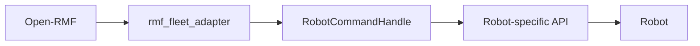
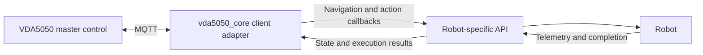

# Migrating an Open-RMF Robot Integration

This guide explains how to reuse existing robot-specific C++ code while replacing `rmf_fleet_adapter` with the VDA5050 client adapter in `vda5050_core::client::adapter`.

## 1. Scope

After migration, the robot integration can:

- receive VDA5050 orders and instant actions over MQTT
- send navigation requests to an existing robot API
- send supported actions to an existing robot API
- report navigation or action success and failure
- update the AGV state
- communicate with a VDA5050 master control

The VDA5050 client adapter replaces the robot-facing fleet adapter layer. It does not replace all Open-RMF functions.

Features such as the following must be provided by the VDA5050 master control or another external system:

- traffic scheduling
- traffic negotiation
- task allocation
- door and lift coordination
- charging workflows
- fleet-level planning


## 2. Architecture Change

A typical Open-RMF integration is structured as:




After migration:




The robot driver, vendor SDK, navigation commands, telemetry polling, and completion detection can usually remain unchanged. The main change is the layer that sends commands to the robot and receives status updates.

## 3. Conceptual Mapping

The Open-RMF and VDA5050 APIs are not identical, but the following concepts have similar roles.


| Open-RMF concept           | `vda5050_core` concept                             |
| -------------------------- | -------------------------------------------------- |
| Fleet adapter              | VDA5050 client adapter                             |
| `RobotCommandHandle`       | Navigation and instant-action callbacks            |
| Full path or waypoint list | Released VDA5050 nodes and edges                   |
| Path completion callback   | `OrderExecution::finished()`                       |
| Action completion callback | `ActionExecution::finished()`                      |
| Robot position update      | `StateManager::set_position()`                     |
| Robot movement update      | `StateManager::set_driving()`                      |
| Fleet and robot identity   | Manufacturer and serial number in MQTT topics      |
| RMF traffic schedule       | Orders generated and coordinated by master control |


This mapping is only conceptual. Open-RMF and VDA5050 assign responsibilities differently, so the migration is not a direct one-to-one replacement.

## 4. Keep the Robot API Independent

Before changing the adapter layer, keep the robot-specific API independent of Open-RMF types.

```cpp
class RobotAPI
{
public:
  void navigate(
    double x, double y, double theta, const std::string& map_id);
  void stop();
  void execute_action(const std::string& action_type);

  bool navigation_completed() const;
  bool action_completed() const;
  bool navigation_failed() const;
  bool action_failed() const;
};
```

Open-RMF types such as `RobotCommandHandle` and `RobotUpdateHandle` should remain inside the old adapter layer.

The robot communication and hardware logic should not depend directly on Open-RMF. This makes it easier to connect the same robot API to the VDA5050 client adapter.  

## 5. Replace Adapter Setup

Replace fleet and robot registration with an MQTT client, protocol adapter, and VDA5050 client adapter:

```cpp
#include "vda5050_core/client/adapter/adapter.hpp"
#include "vda5050_core/execution/protocol_adapter.hpp"
#include "vda5050_core/transport/mqtt_client_interface.hpp"

auto mqtt_client =
  vda5050_core::transport::create_default_client_unique(
    "tcp://localhost:1883", "my-vda5050-adapter");

auto protocol_adapter =
  vda5050_core::execution::ProtocolAdapter::make(
    std::move(mqtt_client),
    "uagv",
    "2.0.0",
    "MyCompany",
    "AGV-001");

auto adapter =
  vda5050_core::client::adapter::Adapter::make(protocol_adapter);

auto state_manager = adapter->state_manager();
```

Each MQTT client ID must be unique at the broker. The interface, version, manufacturer, and serial number define the VDA5050 topic identity.

For example:

```
uagv/v2/MyCompany/AGV-001/order
uagv/v2/MyCompany/AGV-001/instantActions
uagv/v2/MyCompany/AGV-001/state
```


## 6. Replace Path Handling

Open-RMF provides a complete path or waypoint list. The VDA5050 client adapter delivers navigation requests through the  
`on_navigate()` callback.

Each request includes:

- a `NodeRequest`
- an optional `EdgeRequest`
- an `OrderExecution` handle

```cpp
#include <memory>
#include <optional>

#include "vda5050_core/client/adapter/edge_request.hpp"
#include "vda5050_core/client/adapter/node_request.hpp"
#include "vda5050_core/client/adapter/order_execution.hpp"

using vda5050_core::client::adapter::EdgeRequest;
using vda5050_core::client::adapter::NodeRequest;
using vda5050_core::client::adapter::OrderExecution;

std::shared_ptr<OrderExecution> active_navigation;

adapter->on_navigate(
  [&](NodeRequest node, std::optional<EdgeRequest> edge,
      std::shared_ptr<OrderExecution> execution) {
    const auto& position = node.node_position();
    if (!position.has_value())
    {
      execution->failed("Navigation request has no node position");
      return;
    }

    const auto& target = position.value();
    state_manager->set_driving(true);

    robot_api->navigate(
      target.x,
      target.y,
      target.theta.value_or(0.0),
      target.map_id);

    active_navigation = std::move(execution);
  });
```

Do not report success immediately after sending the robot command. Keep the execution handle until the robot physically reaches the requested position.

Report the result from the robot telemetry or status loop.

```cpp
if (active_navigation && robot_api->navigation_completed())
{
  state_manager->set_driving(false);
  active_navigation->finished();
  active_navigation.reset();
}
else if (active_navigation && robot_api->navigation_failed())
{
  state_manager->set_driving(false);
  active_navigation->failed("Robot could not reach the requested node");
  active_navigation.reset();
}
```

The adapter waits for the current navigation execution to finish before continuing with the next request.

## 7. Replace Action Handling

Register an action callback for actions that must be handled by the robot integration.

```cpp
#include "vda5050_core/client/adapter/action_execution.hpp"
#include "vda5050_core/client/adapter/action_request.hpp"

using vda5050_core::client::adapter::ActionExecution;
using vda5050_core::client::adapter::ActionRequest;

std::shared_ptr<ActionExecution> active_action;

adapter->on_action(
  [&](ActionRequest request, std::shared_ptr<ActionExecution> execution) {
    execution->running();
    robot_api->execute_action(request.action_type());
    active_action = std::move(execution);
  });
```

Report action completion from the robot status loop.

```cpp
if (active_action && robot_api->action_completed())
{
  active_action->finished();
  active_action.reset();
}
else if (active_action && robot_api->action_failed())
{
  active_action->failed("Robot action failed");
  active_action.reset();
}
```

Some standard instant actions may be handled internally by the adapter.

## 8. Replace Robot State Updates

Replace `RobotUpdateHandle` updates with `StateManager` updates.

```cpp
state_manager->set_position(
  current_x, current_y, current_theta, current_map_id);
state_manager->set_driving(robot_api->is_moving());
state_manager->set_operating_mode(
  vda5050_core::types::OperatingMode::AUTOMATIC);
state_manager->set_battery_state(battery_state);
```

Additional setters cover velocity, safety state, paused state, loads, errors, and information. The adapter owns order-related fields such as `orderId`, `nodeStates`, `edgeStates`, and `lastNodeId`.

## 9. Coordinate Frames

The robot coordinate frame and VDA5050 map layout must match. The following values should be consistent with the master-control layout:

- map ID
- x position
- y position
- orientation
- distance units
- angle units

If the robot uses a different coordinate frame, convert the position before:

- sending a navigation command to the robot
- updating the position through `StateManager`

Keep this transformation at the robot API boundary unless the current adapter API provides a supported transformation feature.

## 10. Start and Stop

Register callbacks before starting the adapter.

```cpp
adapter->start();

while (running)
{
  update_robot_state();
  check_navigation_completion();
  check_action_completion();
  std::this_thread::sleep_for(std::chrono::milliseconds(100));
}

adapter->stop();
```


## 11. Configuration Changes

Remove settings that only apply to Open-RMF, such as schedule participants, traffic negotiation, finishing requests, and RMF task configuration. Add the MQTT and VDA5050 identity required for each robot:

```yaml
robot:
  manufacturer: MyCompany
  serial_number: AGV-001
  interface_name: uagv
  version: "2.0.0"

mqtt:
  broker_uri: tcp://localhost:1883
  client_id: my-vda5050-adapter
```

The configuration schema is application-specific.

## 12. CMake Integration

Link the client target in the robot integration.

```
find_package(vda5050_core REQUIRED)

target_link_libraries(my_robot_adapter
  PRIVATE
    vda5050_core::client
)
```

Add other targets only when the application uses them directly.

For example:

```
target_link_libraries(my_robot_adapter
  PRIVATE
    vda5050_core::client
    vda5050_core::transport
)
```

The exact targets required depend on the dependencies exported by the current  
branch.

## 13. Test the Migration

Build the examples:

```
colcon build \
  --packages-select vda5050_core \
  --cmake-args -DBUILD_EXAMPLES=ON
```

Source the workspace:

```
source install/setup.bash
```

Start a local MQTT broker:

```
mosquitto -d
```

Run the client adapter example:

```
ros2 run vda5050_core adapter_example
```

Run the order publisher in another sourced terminal:

```
ros2 run vda5050_core order_publisher
```

Check the current branch to confirm the exact executable names and example behaviour.

Use the examples to test:

- MQTT connectivity
- VDA5050 topic identity
- order reception
- navigation request dispatch
- action request dispatch
- state updates
- state publication
- connection messages
- navigation completion
- action completion
- failure reporting


## 14. Migration Checklist

Confirm that the migrated integration:

- connects to the expected MQTT broker
- uses a unique MQTT client ID
- subscribes to the correct AGV topics
- receives VDA5050 orders
- forwards navigation requests to the robot API
- keeps execution handles until physical completion
- reports navigation success
- reports navigation failure with a reason
- forwards supported actions to the robot API
- reports action success and failure
- updates AGV position
- updates the driving state
- updates battery and operating mode
- publishes state and connection messages
- uses the same map IDs and coordinate frames as the master control
- stops cleanly during application shutdown


## 15. Experimental Limitations

The client adapter is still experimental.

For detailed client adapter usage, see  [Client Adapter](client-adapter.md)  