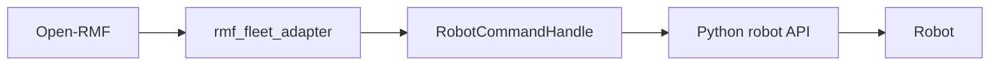
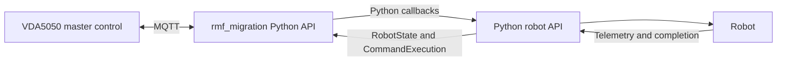

# Migrating an Open-RMF Robot Integration using Python Bindings

This guide explains how to reuse existing robot-specific Python API while replacing Open-RMF fleet adapter layer with the VDA5050 client adapter provided by `vda5050_core_python`.

The Python bindings are exposed through:

```
from vda5050_core_python import rmf_migration
```

## 1. Scope

After migration, the robot integration can:

- receive VDA5050 orders and instant actions over MQTT
- forward navigation and action requests to an existing Python robot API
- report navigation or action success and failure
- update AGV state
- communicate with a VDA5050 master control

The VDA5050 client adapter replaces the robot-facing fleet adapter layer only. It does not replace all Open-RMF functions. The following must come from the VDA5050 master control or another external system:

- traffic scheduling
- traffic negotiation
- task allocation
- door and lift coordination
- charging workflows
- fleet-level planning


## 2. Architecture Change

A typical Open-RMF integration is structured as:




After migration:




Your robot driver, vendor SDK, REST/gRPC client, telemetry polling, and completion detection can usually remain unchanged. Only the layer that dispatches commands and publishes state changes.

## 3. Python API Mapping

Import the migration API:

```python
from vda5050_core_python import rmf_migration
```

A conceptual mapping between the APIs is shown below.


| Open-RMF Python concept                           | `vda5050_core_python` concept                                   |
| ------------------------------------------------- | --------------------------------------------------------------- |
| `rmf_adapter.Adapter`                             | `rmf_migration.Adapter`                                         |
| `adapter.add_easy_fleet(config)`                  | `adapter.add_vda5050_fleet(config)`                             |
| `EasyFullControlConfiguration`                    | `rmf_migration.FleetConfiguration`                              |
| `fleet.add_robot(name, state, config, callbacks)` | `rmf_migration.FleetUpdateHandle.add_robot(...)`                |
| `RobotCallbacks(navigate, stop, execute_action)`  | `rmf_migration.RobotCallbacks(navigate, stop, action_executor)` |
| `RobotState(map, position, battery_soc)`          | `rmf_migration.RobotState(map, position, battery_soc)`          |
| `Destination` (goal handed to `navigate`)         | `rmf_migration.Destination`                                     |
| `CommandExecution.finished()`                     | `rmf_migration.CommandExecution.finished()`                     |
| `ActivityIdentifier`                              | `rmf_migration.ActivityIdentifier`                              |
| `RobotUpdateHandle.update_position(...)`          | `rmf_migration.RobotUpdateHandle.update(state)`                 |
| Fleet name in RMF config                          | Manufacturer + serial number in MQTT topics                     |
| RMF traffic schedule                              | Orders generated and coordinated by master control              |


This mapping is conceptual rather than one-to-one because Open-RMF and VDA5050 divide system responsibilities differently.

## 4. Keep the Robot API Independent

Before replacing the adapter, separate the robot-specific implementation from Open-RMF. The robot API should use ordinary Python types and should not import `rmf_adapter` or `vda5050_core_python`.

```python
# robot_api.py
from typing import Optional


class RobotAPI:
    """Robot-specific interface independent of RMF and VDA5050."""

    def navigate(self, x: float, y: float, theta: float, map_id: str) -> None:
        """Send a navigation command to the robot."""
        ...

    def stop(self) -> None:
        """Stop the robot."""
        ...

    def execute_action(self, action_type: str, params: dict) -> None:
        """Start a robot-specific action."""
        ...

    def position(self) -> tuple[float, float, float]:
        """Returns (x, y, theta) in the robot frame."""
        ...

    def map_id(self) -> str:
        ...

    def battery_soc(self) -> float:
        """0.0 - 1.0"""
        ...

    def is_moving(self) -> bool:
        ...

    def navigation_completed(self) -> bool: ...
    def navigation_failed(self) -> bool: ...
    def action_completed(self) -> bool: ...
    def action_failed(self) -> bool: ...
```

This allows the same robot API to be reused after replacing the adapter.

## 5. Replace Adapter Setup and Create Fleet Configuration

**Old (Open-RMF):**

```python
from rmf_adapter import Adapter
from rmf_adapter.easy_full_control import EasyFullControlConfiguration

adapter = Adapter.make("my_fleet_adapter")
config = EasyFullControlConfiguration.from_config_files(config_yaml, nav_graph)
fleet = adapter.add_easy_fleet(config)
```

**New (**`vda5050_core_python`**):**

```python
from vda5050_core_python.rmf_migration import (
    Adapter,
    FleetConfiguration,
    RobotConfiguration,
)

# NOTE: Adapter.make is a static factory. Check rmf_migration.hpp for its argument
adapter = Adapter.make()

fleet_config = FleetConfiguration(
    fleet_name="my_fleet",
    broker_uri="tcp://localhost:1883",
    client_id_prefix="my-vda5050-adapter",
    update_interval=30,          # optional, defaults to 30
)

fleet = adapter.add_vda5050_fleet(fleet_config)   # -> FleetUpdateHandle
```

`FleetConfiguration` fields are all mutable after construction:

```python
fleet_config.fleet_name = "my_fleet"
fleet_config.broker_uri = "tcp://mqtt.example.com:1883"
fleet_config.client_id_prefix = "my-vda5050-adapter"
fleet_config.update_interval = 15
```


## 6. Configure Robot's VDA5050 Identity

Each robot requires a RobotConfiguration:

```python
robot_config = RobotConfiguration(
    manufacturer="MyCompany",
    serial_number="AGV-001",
    interface_name="uagv",   # default
    version="2.0.0",         # default
)
robot_config.factsheet = factsheet_object   # optional
```

These four values define the MQTT topic identity:

```
uagv/v2/MyCompany/AGV-001/order
uagv/v2/MyCompany/AGV-001/instantActions
uagv/v2/MyCompany/AGV-001/state
uagv/v2/MyCompany/AGV-001/connection
```

The `client_id_prefix` is combined per robot to produce MQTT client IDs. Every client ID must be unique at the broker. If you run two adapters against one broker, give them different prefixes.

## 7. Pre-register Known Robots

A robot configuration may be stored in the fleet configuration before the robot is added. `known_robots` is exposed as a read-only property.

```python
fleet_config.add_known_robot_configuration("tinyRobot1", robot_config)

# Retrieve later
cfg = fleet_config.get_known_robot_configuration("tinyRobot1")

# All registered robots
for name in fleet_config.known_robots:
    print(name)
```


## 8. Handle Navigation Requests

The navigation callback receives a destination and a command-execution handle.

```python
from vda5050_core_python.rmf_migration import Destination, CommandExecution

active_navigation: CommandExecution | None = None


def navigate(destination: Destination, execution: CommandExecution) -> None:
    """NavigationRequest callback.

    Verify the exact signature against rmf_migration.hpp — the C++ typedef is
    NavigationRequest and this mirrors rmf_adapter's easy_full_control convention.
    """
    global active_navigation

    x, y = destination.xy          # or destination.position -> (x, y, yaw)
    yaw = destination.yaw
    map_id = destination.map

    if destination.speed_limit is not None:
        robot_api.set_speed_limit(destination.speed_limit)

    robot_api.navigate(x, y, yaw, map_id)
    active_navigation = execution
```

`Destination` is read-only. Available properties, all from the bindings:


| Property      | Meaning                           |
| ------------- | --------------------------------- |
| `map`         | Map / VDA5050 `mapId` of the goal |
| `position`    | Full pose, `(x, y, yaw)`          |
| `xy`          | Planar position only              |
| `yaw`         | Orientation                       |
| `graph_index` | Nav-graph waypoint index, if any  |
| `name`        | Waypoint name, if any             |
| `speed_limit` | Optional speed limit for this leg |


**Do not call** `execution.finished()` **right after dispatching the command.** Hold the handle until the robot has physically arrived, and report from your telemetry loop:

```python
def check_navigation_completion() -> None:
    global active_navigation
    if active_navigation is None:
        return

    if robot_api.navigation_completed():
        active_navigation.finished()
        active_navigation = None
    elif robot_api.navigation_failed():
        active_navigation.failed("Robot could not reach the requested node")
        active_navigation = None
```

The adapter waits for the current execution to finish before issuing the next request.

### 8.1 `CommandExecution` API

```python
execution.finished()                 # success
execution.failed("reason string")    # failure with a reason
execution.okay()                     # -> bool, is this handle still valid/current?
execution.is_finished()              # -> bool, whether completion has already been reported
execution.identifier                 # -> ActivityIdentifier (read-only)
```

Use `okay()` before acting on a stored execution handle:

```
if execution.okay():
    execution.finished()
```

This helps avoid updating an execution that is no longer active.

### 8.2 `ActivityIdentifier`

An `ActivityIdentifier` can contain an order ID and an action ID. Both arguments are optional.

```python
from vda5050_core_python.rmf_migration import ActivityIdentifier

ident = execution.identifier
print(ident.order_id)    # Optional[str], read-only
print(ident.action_id)   # Optional[str], read-only

# Constructing one directly (both arguments optional):
ident = ActivityIdentifier(order_id="order-123", action_id=None)

# Equality is bound, so this works:
if execution.identifier == expected_ident:
    ...
```


## 9. Handle Stop Requests

The stop callback should stop the robot and clear any corresponding local execution state.

```python
def stop(activity: ActivityIdentifier) -> None:
    """StopRequest callback. Confirm the argument type in rmf_migration.hpp."""
    global active_navigation
    robot_api.stop()
    if active_navigation is not None and active_navigation.identifier == activity:
        active_navigation = None
```

The exact argument type and callback signature should be confirmed using the Python-generated documentation:

```
help(vda5050_core_python.rmf_migration.RobotCallbacks)
```

## 10. Handle Robot Actions

Store the execution handle until the robot reports that the action has finished or failed.

```python
active_action: CommandExecution | None = None

SUPPORTED_ACTIONS = {"pick", "drop", "wait"}


def action_executor(
    category: str,
    description: dict,
    execution: CommandExecution,
) -> None:
    """ActionExecutor callback. Confirm the signature in rmf_migration.hpp."""
    global active_action

    if category not in SUPPORTED_ACTIONS:
        execution.failed(f"Unsupported action: {category}")
        return

    robot_api.execute_action(category, description)
    active_action = execution
```

Report action completion from the robot status loop:

```python
def check_action_completion() -> None:
    global active_action
    if active_action is None:
        return

    if robot_api.action_completed():
        active_action.finished()
        active_action = None
    elif robot_api.action_failed():
        active_action.failed("Robot action failed")
        active_action = None
```

The exact parameters of `ActionExecutor` should be verified against the current Python bindings before deployment.

## 11. Assemble the callbacks

Create a `RobotCallbacks` object:

```python
from vda5050_core_python.rmf_migration import RobotCallbacks

callbacks = RobotCallbacks(
    navigate=navigate,
    stop=stop,
    action_executor=action_executor,
)
```

All three are required positional/keyword arguments. They are exposed read-only afterwards (`callbacks.navigate`, `callbacks.stop`, `callbacks.action_executor`).

## 12. Optional Localization Callback

The localization callback is optional and can be assigned after constructing `RobotCallbacks`.

```python
def localize(destination: Destination, execution: CommandExecution) -> None:
    robot_api.set_initial_pose(*destination.position, destination.map)
    execution.finished()

callbacks.localize = localize     # optional; omit if the robot self-localizes
```

Omit this callback when the robot performs localization independently.

## 13. Register the robot

Add the robot to the fleet:

```python
from vda5050_core_python.rmf_migration import RobotState

initial_state = RobotState(
    map="L1",
    position=[0.0, 0.0, 0.0],   # array<double,3> -> any 3-element sequence
    battery_soc=0.95,           # 0.0 - 1.0
)

robot_handle = fleet.add_robot(
    "tinyRobot1",
    initial_state,
    robot_config,
    callbacks,
)   # -> RobotUpdateHandle
```

> The Python binding for `add_robot()` does not expose named arguments. Therefore, pass the arguments positionally. Verify against `rmf_migration.hpp`.


## 14. Create the Robot State Updates


### 14.1 High level: `RobotUpdateHandle.update()`

```python
def update_robot_state() -> None:
    x, y, theta = robot_api.position()
    state = RobotState(
        map=robot_api.map_id(),
        position=[x, y, theta],
        battery_soc=robot_api.battery_soc(),
    )
    robot_handle.update(state)
```

`RobotState` fields are mutable, so you can also reuse one object:

```python
state.map = "L2"
state.position = [1.5, 2.0, 1.57]
state.battery_state_of_charge = 0.82
robot_handle.update(state)
```

Note the asymmetry: the constructor keyword is `battery_soc`, but the property is `battery_state_of_charge`.

### 14.2 Low level: `client.StateManager`

`RobotState` only carries map, pose, and battery SoC. For everything else VDA5050 publishes (velocity, safety state, operating mode, errors, information, load) reach for `StateManager`. `RobotUpdateHandle.more()` is the escape hatch that exposes the extended API:

```python
extended = robot_handle.more()
```

> `more()` is bound as a lambda returning `self.more()`. Inspect what it returns on your branch (`type(extended)`, `dir(extended)`). In the RMF convention this is the "unstable" extended handle, and it is the natural place for the `StateManager` to hang off. If it is not reachable from there, construct the client adapter directly via the `client` submodule instead.

Once you have a `StateManager`:

```python
from vda5050_core_python.client import (
    BatteryState,
    OperatingMode,
    SafetyState,
    EStop,
    Velocity,
)

state_manager.set_position(current_x, current_y, current_theta, current_map_id)
state_manager.set_driving(robot_api.is_moving())
state_manager.set_paused(False)
state_manager.set_operating_mode(OperatingMode.AUTOMATIC)
state_manager.set_distance_since_last_node(3.42)
state_manager.set_new_base_request(False)

velocity = Velocity()
velocity.vx = 0.4
velocity.vy = 0.0
velocity.omega = 0.1
state_manager.set_velocity(velocity)

battery = BatteryState()
battery.battery_charge = 82.0      # percent
battery.battery_voltage = 24.6
battery.battery_health = 95
battery.charging = False
battery.reach = 12000              # metres
state_manager.set_battery_state(battery)

safety = SafetyState()
safety.e_stop = EStop.NONE
safety.field_violation = False
state_manager.set_safety_state(safety)
```

The adapter owns order-related fields (`orderId`, `nodeStates`, `edgeStates`, `lastNodeId`).

### 14.3 Errors and information

```python
from vda5050_core_python.client import (
    Error, ErrorLevel, ErrorReference,
    Info, InfoLevel, InfoReference,
)

ref = ErrorReference()
ref.reference_key = "nodeId"
ref.reference_value = "node-7"

error = Error()
error.error_type = "navigationBlocked"
error.error_references = [ref]                 # list, via pybind11/stl
error.error_description = "Path blocked by obstacle for 30s"
error.error_level = ErrorLevel.WARNING

state_manager.add_error(error)
# state_manager.set_errors([error])   # replace the whole list
# state_manager.clear_errors()

info_ref = InfoReference()
info_ref.reference_key = "sensor"
info_ref.reference_value = "lidar_front"

info = Info()
info.info_type = "diagnostics"
info.info_references = [info_ref]
info.info_description = "Front lidar reporting reduced range"
info.info_level = InfoLevel.DEBUG

state_manager.add_information(info)
# state_manager.set_information([info])
# state_manager.remove_information("diagnostics")
```


### 14.4 Action states

If you manage VDA5050 action states directly rather than through `CommandExecution`:

```python
from vda5050_core_python.client import ActionState, ActionStatus

action_state = ActionState()
action_state.action_id = "action-42"
action_state.action_type = "pick"
action_state.action_description = "Pick pallet from station A"
action_state.action_status = ActionStatus.RUNNING
action_state.result_description = ""

state_manager.add_action_state(action_state)
# state_manager.set_action_states([action_state])
# state_manager.clear_action_states()
```

`ActionStatus` values: `WAITING`, `INITIALIZING`, `RUNNING`, `PAUSED`, `FINISHED`, `FAILED`.

All `client` types bind `__eq__` and `__ne__`, so `==` comparisons work as expected. They also all have a default constructor and mutable fields, build them field by field, not via keyword arguments.

## 15. Coordinate Frames

The robot frame and the VDA5050 map layout must agree. These must be consistent with the master-control layout:

- map ID
- x position
- y position
- orientation
- distance units
- angle units

If the robot uses a different frame, convert **at the robot API boundary**: before sending a navigation command, and before building a `RobotState` or calling `set_position()`:

```python
def to_vda_frame(x: float, y: float, theta: float) -> tuple[float, float, float]:
    return (x * SCALE + OFFSET_X, y * SCALE + OFFSET_Y, theta + ROTATION)


def to_robot_frame(x: float, y: float, theta: float) -> tuple[float, float, float]:
    return ((x - OFFSET_X) / SCALE, (y - OFFSET_Y) / SCALE, theta - ROTATION)
```

Keep coordinate transformations in one place to avoid inconsistent state and navigation data.

## 16. Start and Stop the Adapter

Register all callbacks and add all robots **before** starting the adapter.

```python
import time

adapter.start()

try:
    while running:
        update_robot_state()
        check_navigation_completion()
        check_action_completion()
        time.sleep(0.1)
except KeyboardInterrupt:
    pass
finally:
    adapter.stop()
```

Because callbacks are invoked from C++ threads, guard any shared state:

```python
import threading

lock = threading.Lock()

def navigate(destination, execution):
    global active_navigation
    with lock:
        robot_api.navigate(*destination.position, destination.map)
        active_navigation = execution
```


## 17. Configuration Changes

Drop settings that only mean something to Open-RMF: schedule participants, traffic negotiation, finishing requests, RMF task configuration, nav graph references used for traffic. Add MQTT and VDA5050 identity:

yaml

```yaml
fleet:
  name: my_fleet
  update_interval: 30

mqtt:
  broker_uri: tcp://localhost:1883
  client_id_prefix: my-vda5050-adapter

robots:
  tinyRobot1:
    manufacturer: MyCompany
    serial_number: AGV-001
    interface_name: uagv
    version: "2.0.0"
```

Loading it:

```python
import yaml
from vda5050_core_python.rmf_migration import FleetConfiguration, RobotConfiguration

with open("config.yaml") as f:
    cfg = yaml.safe_load(f)

fleet_config = FleetConfiguration(
    fleet_name=cfg["fleet"]["name"],
    broker_uri=cfg["mqtt"]["broker_uri"],
    client_id_prefix=cfg["mqtt"]["client_id_prefix"],
    update_interval=cfg["fleet"].get("update_interval", 30),
)

for name, r in cfg["robots"].items():
    fleet_config.add_known_robot_configuration(
        name,
        RobotConfiguration(
            manufacturer=r["manufacturer"],
            serial_number=r["serial_number"],
            interface_name=r.get("interface_name", "uagv"),
            version=r.get("version", "2.0.0"),
        ),
    )
```

The YAML structure is application-specific. The Python bindings do not currently expose an equivalent to Open-RMF's `from_config_files()` helper.

## 18. Build the Python Bindings

The module is a pybind11 extension named `vda5050_core_python`, built from `vda5050_core/python/bindings.cpp`. Build it with the rest of the package:

```bash
colcon build --packages-select vda5050_core --cmake-args -DBUILD_PYTHON=ON
source install/setup.bash
```

## 19. Complete Example

```python
#!/usr/bin/env python3
"""Minimal VDA5050 fleet adapter using vda5050_core_python.rmf_migration."""

import threading
import time

from vda5050_core_python.rmf_migration import (
    Adapter,
    CommandExecution,
    Destination,
    FleetConfiguration,
    RobotCallbacks,
    RobotConfiguration,
    RobotState,
)

from robot_api import RobotAPI

robot_api = RobotAPI()
lock = threading.Lock()
active_navigation: CommandExecution | None = None
active_action: CommandExecution | None = None


def navigate(destination: Destination, execution: CommandExecution) -> None:
    global active_navigation
    with lock:
        x, y = destination.xy
        robot_api.navigate(x, y, destination.yaw, destination.map)
        active_navigation = execution


def stop(activity) -> None:
    global active_navigation
    with lock:
        robot_api.stop()
        active_navigation = None


def action_executor(category: str, description: dict,
                    execution: CommandExecution) -> None:
    global active_action
    with lock:
        if category not in ("pick", "drop"):
            execution.failed(f"Unsupported action: {category}")
            return
        robot_api.execute_action(category, description)
        active_action = execution


def poll() -> None:
    global active_navigation, active_action
    with lock:
        if active_navigation is not None:
            if robot_api.navigation_completed():
                active_navigation.finished()
                active_navigation = None
            elif robot_api.navigation_failed():
                active_navigation.failed("Could not reach requested node")
                active_navigation = None

        if active_action is not None:
            if robot_api.action_completed():
                active_action.finished()
                active_action = None
            elif robot_api.action_failed():
                active_action.failed("Robot action failed")
                active_action = None


def publish_state(handle) -> None:
    x, y, theta = robot_api.position()
    handle.update(
        RobotState(
            map=robot_api.map_id(),
            position=[x, y, theta],
            battery_soc=robot_api.battery_soc(),
        )
    )


def main() -> None:
    adapter = Adapter.make()

    fleet_config = FleetConfiguration(
        fleet_name="my_fleet",
        broker_uri="tcp://localhost:1883",
        client_id_prefix="my-vda5050-adapter",
        update_interval=30,
    )

    robot_config = RobotConfiguration(
        manufacturer="MyCompany",
        serial_number="AGV-001",
        interface_name="uagv",
        version="2.0.0",
    )
    fleet_config.add_known_robot_configuration("tinyRobot1", robot_config)

    fleet = adapter.add_vda5050_fleet(fleet_config)

    callbacks = RobotCallbacks(
        navigate=navigate,
        stop=stop,
        action_executor=action_executor,
    )

    x, y, theta = robot_api.position()
    handle = fleet.add_robot(
        "tinyRobot1",
        RobotState(robot_api.map_id(), [x, y, theta], robot_api.battery_soc()),
        robot_config,
        callbacks,
    )

    adapter.start()
    try:
        while True:
            poll()
            publish_state(handle)
            time.sleep(0.1)
    except KeyboardInterrupt:
        pass
    finally:
        adapter.stop()


if __name__ == "__main__":
    main()
```

---

## 20. Test the Migration

Start a local broker:

```bash
mosquitto -d
```

Run your adapter:

```bash
python3 my_fleet_adapter.py
```

Watch the topics from another terminal:

```bash
mosquitto_sub -t 'uagv/v2/MyCompany/AGV-001/#' -v
```

Publish a test order:

```bash
mosquitto_pub -t 'uagv/v2/MyCompany/AGV-001/order' -f test_order.json
```

Or use the packaged examples:

```bash
ros2 run vda5050_core order_publisher
```

Verify:

- the Python module imports successfully
- the adapter connects to the MQTT broker
- the expected VDA5050 topics are used
- orders reach the client
- the navigation callback is triggered
- destinations contain valid map and position values
- actions reach the action callback
- state updates are published
- navigation completion is reported
- action completion is reported
- navigation failures are handled
- action failures are handled
- stop requests stop the corresponding robot activity
- the adapter shuts down cleanly

## 18. Experimental Limitations

The Python migration API is experimental.

For detailed adapter usage, see [Client Adapter](client-adapter.md).