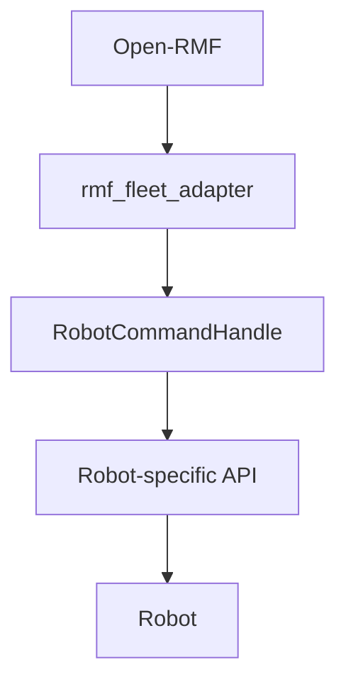
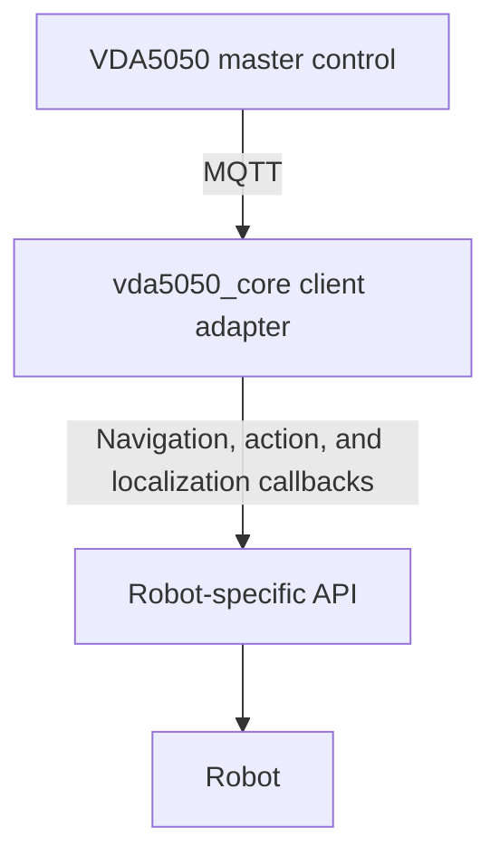

# vda5050_core::python::rmf_migration

This document describes the rmf_migration Python API, a compatibility layer that lets an existing Open-RMF fleet adapter be moved onto VDA5050 with minimal changes to the robot integration code.

## Migration Outcome

After completing this guide, the robot integration should be able to:

- receive VDA5050 orders and instant actions over MQTT
- navigation and action requests to the existing robot API
- initialize the robot position from an `initPosition` request
- report command completion or failure
- publish the latest robot position and operating state
- communicate with a VDA5050 master control

> `vda5050_core` replaces the robot-facing fleet adapter layer. It does not replace every Open-RMF feature.
>
> Traffic scheduling, negotiation, task allocation, doors, lifts, and charging workflows must be provided by the VDA5050 master control or another external system.

## Contents

- [Before You Begin](#before-you-begin)
- [Overview](#overview)
- [What You Can Keep](#what-you-can-keep)
- [What You Must Replace](#what-you-must-replace)
- [Conceptual Mapping](#conceptual-mapping)
- [Important Behavioural Differences](#important-behavioural-differences)
- [Migration Steps](#migration-steps)
  - [1. Separate Robot Logic from Open-RMF Logic](#1-separate-robot-logic-from-open-rmf-logic)
  - [2. Replace Open-RMF Adapter Setup](#2-replace-open-rmf-adapter-setup)
  - [3. Replace Path Handling with](#3-replace-path-handling-with-on_navigate) `on_navigate()`
  - [4. Replace Action Handling with](#4-replace-action-handling-with-on_action) `on_action()`
  - [5. Replace Robot Initialization with](#5-replace-robot-initialization-with-on_localize) `on_localize()`
  - [6. Replace](#6-replace-robotupdatehandle-with-statemanager) `RobotUpdateHandle` [with](#6-replace-robotupdatehandle-with-statemanager) `StateManager`
  - [7. Start the Adapter and Update Loop](#7-start-the-adapter-and-update-loop)
- [Configuration Changes](#configuration-changes)
- [Testing the Migrated Adapter](#testing-the-migrated-adapter)

## Before You Begin

This guide assumes that the existing Open-RMF integration already contains: 

- a robot-specific API or command interface
- navigation commands
- stop or pause commands
- action commands
- robot position and telemetry updates
- command-completion detection

For example, the existing robot integration may already provide methods such as: 

```cpp robot_api->navigate(...);
robot_api->stop(); 
robot_api->execute_action(...); 
robot_api->get_position(); 
robot_api->navigation_completed(); 
robot_api->action_completed(); 
```

These robot-specific methods can usually remain in place. The main task is to connect them to the `vda5050_core` adapter instead of `rmf_fleet_adapter`.

## Overview

A typical Open-RMF robot integration follows this structure:



After migration, the integration follows this structure:



The robot driver and robot-specific API normally remain unchanged. The Open-RMF registration, callbacks, and state updates are replaced.

## What You Can Keep

The following components can usually be retained:

- robot navigation commands
- stop or pause commands
- robot action commands
- telemetry polling
- command-completion checks
- coordinate transformations
- communication with the robot through ROS 2, REST APIs, or a vendor SDK

Some method parameters may need to be adapted to accept VDA5050 node, edge, map, and action information.

## What You Must Replace

The following Open-RMF-facing components are replaced:

- Open-RMF adapter creation
- fleet and robot registration
- `RobotCommandHandle`
- `RobotUpdateHandle`
- RMF schedule participation
- RMF navigation graph registration
- RMF position and battery updates
- RMF command-completion callbacks

The replacement uses:

- an MQTT client
- `ProtocolAdapter`
- the `vda5050_core` client `Adapter`
- navigation, action, and localization callbacks
- execution objects for reporting completion or failure
- `StateManager` for reporting robot state

## Conceptual Mapping

The mapping is conceptual rather than strictly one-to-one because Open-RMF and VDA5050 have different responsibilities.


| Open-RMF concept               | `vda5050_core` concept                                  |
| ------------------------------ | ------------------------------------------------------- |
| Fleet adapter                  | VDA5050 client adapter                                  |
| `RobotCommandHandle`           | Navigation, action, and localization callbacks          |
| Full path or waypoint list     | Released VDA5050 nodes and edges                        |
| Path completion callback       | `OrderExecution::finished()`                            |
| Action completion callback     | `ActionExecution::finished()`                           |
| Robot position update          | `StateManager::set_position()`                          |
| Robot movement status          | `StateManager::set_driving()`                           |
| RMF schedule and traffic graph | VDA5050 orders supplied by the master control           |
| Robot-specific API             | Existing robot API, usually reusable with minor changes |
| Fleet and robot names          | Manufacturer and serial number in MQTT topics           |


## Important Behavioural Differences

### - One Destination Is Dispatched at a Time

Open-RMF may provide a path containing multiple waypoints. The `vda5050_core` adapter dispatches released VDA5050 nodes sequentially.

The navigation callback should send the current destination to the robot and report completion only after the robot physically reaches that destination.

### - Completion Must Be Reported Explicitly

Sending a command to the robot does not complete the VDA5050 request. 

The application should retain the execution object and call `finished()` only after the robot physically completes the command. 

If the command fails, report the failure using the failure API provided by the adapter version being used.

### - MQTT Replaces RMF Schedule Communication

The robot communicates with a VDA5050 master through MQTT topics.

Each robot is identified using:

- interface name
- VDA5050 version
- manufacturer
- serial number

For example: 

```text
uagv/v2/Manufacturer/S001/order 
uagv/v2/Manufacturer/S001/state 
```

### - Fleet Coordination Is Provided Externally

The VDA5050 master control generates and releases order nodes and edges. 

The client adapter does not register an RMF traffic graph or perform RMF schedule negotiation.

## Migration Steps

## 1. Separate Robot Logic from Open-RMF Logic

Before modifying the adapter, identify which parts of the existing application are robot-specific and which parts depend on Open-RMF. 

Robot-specific logic should remain separate: 

```cpp
class RobotAPI 
{ 
  public: 
    void navigate( 
      double x, 
      double y, 
      double theta, 
      const std::string& map_id); 
      
      void stop(); 
      
      void execute_action(
        const std::string& action_type); 
      
      bool navigation_completed() const; 
      bool action_completed() const; 
      RobotPosition get_position() const; 
}; 
```

Open-RMF-specific code such as the following will be replaced: 

```cpp
rmf_fleet_adapter::agv::Adapter 
rmf_fleet_adapter::agv::RobotCommandHandle 
rmf_fleet_adapter::agv::RobotUpdateHandle 
```

Keeping these layers separate makes it easier to reuse the existing robot integration.

## 2. Replace Open-RMF Adapter Setup

A simplified Open-RMF integration may create an adapter, add a fleet, and register a robot:

```cpp
#include <rmf_fleet_adapter/agv/EasyFullControl.hpp>

// Simplified Open-RMF example
auto adapter =
  rmf_fleet_adapter::agv::EasyFullControl::make(...);

auto fleet = adapter->add_fleet(...);

fleet->add_robot(
  robot_command_handle,
  robot_name,
  profile,
  start,
  [&](std::shared_ptr<
      rmf_fleet_adapter::agv::RobotUpdateHandle> handle)
  {
    robot_update_handle = handle;
  });
```

> The Open-RMF examples in this guide are simplified. Exact APIs may differ depending on the Open-RMF version and the structure of the existing fleet adapter.

Replace the Open-RMF setup with an MQTT client, protocol adapter, and `vda5050_core` client adapter:

```cpp
#include "vda5050_core/client/adapter/adapter.hpp"
#include "vda5050_core/execution/protocol_adapter.hpp"
#include "vda5050_core/transport/mqtt_client_interface.hpp"

auto mqtt_client =
  vda5050_core::transport::create_default_client_unique(
    "tcp://localhost:1883",
    "my_vda5050_adapter");

auto protocol_adapter =
  vda5050_core::execution::ProtocolAdapter::make(
    std::move(mqtt_client),
    "uagv",
    "2.0.0",
    "Manufacturer",
    "S001");

auto adapter =
  vda5050_core::client::adapter::Adapter::make(
    protocol_adapter);

auto state_manager = adapter->state_manager();
```

The values passed to `ProtocolAdapter::make()` define the MQTT topic identity.


| Value                  | Description            |
| ---------------------- | ---------------------- |
| `tcp://localhost:1883` | MQTT broker URI        |
| `my_vda5050_adapter`   | Unique MQTT client ID  |
| `uagv`                 | VDA5050 interface name |
| `2.0.0`                | VDA5050 version        |
| `Manufacturer`         | Robot manufacturer     |
| `S001`                 | Robot serial number    |


Each running MQTT client must use a unique client ID. Starting multiple clients with the same ID may cause the MQTT broker to disconnect one of them.

## 3. Replace Path Handling with `on_navigate()`

An Open-RMF command handle may receive a complete path:

```cpp
void follow_new_path(
  const std::vector<Destination>& waypoints,
  ArrivalEstimator estimate_arrival,
  RequestCompleted completed) override
{
  robot_api_->navigate(waypoints);

  // Call this only after the path has completed.
  completed();
}
```

With `vda5050_core`, register a callback for each dispatched destination:

```cpp
#include <optional>

#include "vda5050_core/client/adapter/edge_request.hpp"
#include "vda5050_core/client/adapter/node_request.hpp"
#include "vda5050_core/client/adapter/order_execution.hpp"

using vda5050_core::client::adapter::EdgeRequest;
using vda5050_core::client::adapter::NodeRequest;
using vda5050_core::client::adapter::OrderExecution;

std::shared_ptr<OrderExecution> active_navigation;

adapter->on_navigate(
  [&](NodeRequest node_request,
      std::optional<EdgeRequest> edge_request,
      std::shared_ptr<OrderExecution> execution)
  {
    const auto position = node_request.node_position();

    if (!position.has_value())
    {
      // Report failure using the failure API provided by
      // the current adapter version.
      return;
    }

    state_manager->set_driving(true);

    const auto& target = position.value();

    robot_api_->navigate(
      target.x,
      target.y,
      target.theta.value_or(0.0),
      target.map_id);

    // Retain the execution object until the robot arrives.
    active_navigation = execution;
  });
```

Do not call `execution->finished()` immediately after sending the robot command unless the navigation method is synchronous and the robot has already arrived.

Check for physical completion from the telemetry or robot-status loop:

```cpp
if (
  active_navigation &&
  robot_api_->navigation_completed())
{
  state_manager->set_driving(false);

  active_navigation->finished();
  active_navigation.reset();
}
```

The next released node can then be dispatched.

## 4. Replace Action Handling with `on_action()`

An Open-RMF adapter may execute an activity through a command handle:

```cpp
void execute_action(
  const std::string& category,
  const std::string& description,
  ExecuteAction completion) override
{
  robot_api_->start_activity(category);

  // Call after the physical action completes.
  completion();
}
```

Register the equivalent VDA5050 action callback:

```cpp
#include "vda5050_core/client/adapter/action_execution.hpp"
#include "vda5050_core/client/adapter/action_request.hpp"

using vda5050_core::client::adapter::ActionExecution;
using vda5050_core::client::adapter::ActionRequest;

std::shared_ptr<ActionExecution> active_action;

adapter->on_action(
  [&](ActionRequest request,
      std::shared_ptr<ActionExecution> execution)
  {
    execution->running();

    robot_api_->start_activity(
      request.action_type());

    active_action = execution;
  });
```

Report completion from the robot-status loop:

```cpp
if (
  active_action &&
  robot_api_->action_completed())
{
  active_action->finished();
  active_action.reset();
}
```

If the robot cannot complete the action, report the failure using the failure method and parameters exposed by the current adapter API.

## 5. Replace Robot Initialization with `on_localize()`

Open-RMF integrations commonly register a robot with an initial map and position. 

In VDA5050, the master may send an `initPosition` instant action. The client adapter dispatches it through the localization callback:

```cpp
#include "vda5050_core/client/adapter/action_execution.hpp"
#include "vda5050_core/client/adapter/localization_request.hpp"

using vda5050_core::client::adapter::ActionExecution;
using vda5050_core::client::adapter::LocalizationRequest;

adapter->on_localize(
  [&](LocalizationRequest request,
      std::shared_ptr<ActionExecution> execution)
  {
    const bool success = robot_api_->localize(
      request.x(),
      request.y(),
      request.theta(),
      request.map_id());

    if (!success)
    {
      // Report failure using the API provided by
      // the current adapter version.
      return;
    }

    state_manager->set_position(
      request.x(),
      request.y(),
      request.theta(),
      request.map_id());

    execution->finished();
  });
```

Updating the position allows the adapter to report that the robot position has been initialized.

## 6. Replace `RobotUpdateHandle` with `StateManager`

An Open-RMF integration may publish robot state through `RobotUpdateHandle`:

```cpp
robot_update_handle->update_position(...);
robot_update_handle->update_battery_soc(...);
```

With `vda5050_core`, report the latest robot state through `StateManager`:

```cpp
state_manager->set_position(
  current_x,
  current_y,
  current_theta,
  current_map_id);

state_manager->set_driving(
  robot_api_->is_moving());
```

Depending on the version of `StateManager`, additional state setters may be available for:

- battery state
- velocity
- operating mode
- safety state
- loads
- errors;
- informational messages

Use only the setters exposed by the version of `vda5050_core` being deployed.

## 7. Start the Adapter and Update Loop

Register all callbacks before starting the adapter:

```cpp
adapter->on_navigate(...); 
adapter->on_action(...); 
adapter->on_localize(...); 

adapter->start(); 
```

Keep the application running while polling robot telemetry and checking command completion:

```cpp
while (running) 
{ 
  update_robot_state(); 
  check_navigation_completion(); 
  check_action_completion(); 

  std::this_thread::sleep_for( 
    std::chrono::milliseconds(100)); 
} 
```

Stop the adapter during shutdown:

```cpp
adapter->stop();
```

## Configuration Changes

Remove or relocate settings that apply only to Open-RMF, including:

- vehicle traits
- the RMF navigation graph
- schedule participants
- traffic negotiation settings
- finishing requests
- RMF-specific task configuration

Add MQTT and VDA5050 identity settings for every robot:

```yaml
fleet:
  name: demo_fleet

  robots:
    robot_1:
      manufacturer: MyCompany
      serial_number: AGV-001
      interface_name: uagv
      version: "2.0.0"

      initial_state:
        map_id: map1
        x: 0.0
        y: 0.0
        theta: 0.0

mqtt:
  broker_uri: tcp://localhost:1883
  client_id: demo_fleet_adapter
```

The configuration structure is application-specific. The example above shows the values commonly required by a VDA5050 integration.

Coordinate frames and VDA5050 map IDs must be aligned with the master control.

If the robot API uses another coordinate frame, retain the coordinate transformation at the robot API boundary.

## Testing the Migrated Adapter

Build and run the migrated adapter application together with an MQTT broker and the intended VDA5050 master control.

For initial testing, the included order_publisher can be used to send initialization requests and test orders:

```bash
ros2 run vda5050_core adapter_example
```

The publisher sends:

```text
factsheetRequest
→ stateRequest
→ initPosition
→ test order
→ order updates
```

Confirm that the migrated adapter:

- receives the initialization requests
- forwards dispatched nodes to the existing robot API
- reports navigation and action completion
- updates the robot position and driving state
- publishes VDA5050 state messages
- handles subsequent order updates

Expected adapter output includes:

```text
Received factsheetRequest
Received stateRequest
Received initPosition
Localization successful
Accepted new order [test_order]
Dispatching node ID [N0]
Navigating to node [N0]
Reached node [N0]
```

The robot-specific output should then confirm that the request reached the existing robot API.

For a standalone reference implementation of the client adapter API, see `adapter_example.cpp`.

